# 🎓 Student CRM Platform

Full stack CRM platform built for the SINC Full Stack Developer Test of Competence.


# 📌 Project Overview

Student CRM Platform is a production-style full stack CRM application designed for education sales teams.

The platform is being developed to manage:

* student lead onboarding
* realtime communication workflows
* sales assignment management
* deal ownership tracking
* pipeline stage progression
* role-aware access control
* operational sales visibility

This project is being built as part of the SINC Full Stack Developer Test of Competence.

The assessment evaluates the ability to design and deliver a modern SaaS-style application using scalable frontend architecture, secure authentication flows, realtime systems, relational data modeling, and production engineering practices.

# 🎯 Engineering Objectives

This project focuses on demonstrating practical full stack engineering capabilities through the implementation of a real-world CRM platform.

Core engineering goals include:

* scalable frontend architecture
* production-style authentication systems
* protected route handling
* role-aware application design
* relational database modeling
* realtime communication workflows
* maintainable project organization
* cloud-native development practices
* clean engineering documentation
* deployment-ready infrastructure

# 🧱 High-Level System Architecture

The application follows a modular cloud-native architecture using React on the frontend, Supabase for authentication and database infrastructure, and Cloudflare Workers for backend APIs.

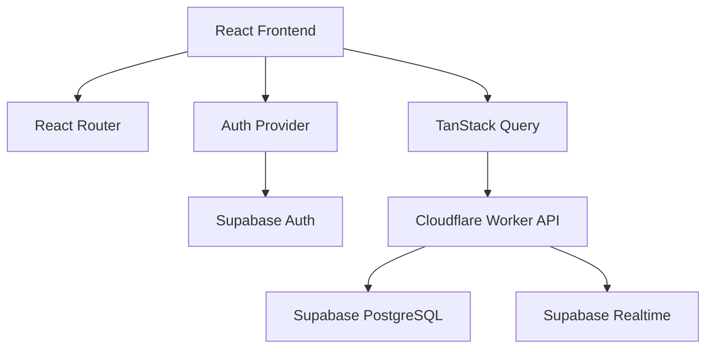

# 🛠️ Technology Stack

## Frontend

* React
* TypeScript
* Vite
* React Router
* TanStack Query
* Tailwind CSS
* shadcn/ui

## Backend

* Hono
* Cloudflare Workers

## Database & Infrastructure

* Supabase PostgreSQL
* Supabase Auth
* Supabase Realtime

# ⚙️ Local Development Setup

## Clone Repository

```bash
git clone https://github.com/Holuphilix/student-crm-platform.git
```

## Navigate Into Frontend

```bash
cd frontend
```

## Install Dependencies

```bash
npm install
```

## Start Development Server

```bash
npm run dev
```

# 🔐 Environment Variables

Create a `.env` file inside:

```txt
frontend/
```

Add the following variables:

```env
VITE_SUPABASE_URL=your_project_url
VITE_SUPABASE_PUBLISHABLE_KEY=your_publishable_key
```

# 📂 Project Structure

```txt
student-crm-platform/
│
├── frontend/
├── worker/
├── README.md
```

# 🧠 Frontend Architecture

The frontend uses a feature-based architecture designed for scalability, maintainability, and production-style application organization.

## Frontend Structure

```txt
src/
  app/
    providers/
    router/

  components/
    layout/
    shared/
    ui/

  features/
    auth/
    clients/
    conversations/
    deals/
    dashboard/

  lib/
    api/
    supabase/
```

## Frontend Architecture Diagram

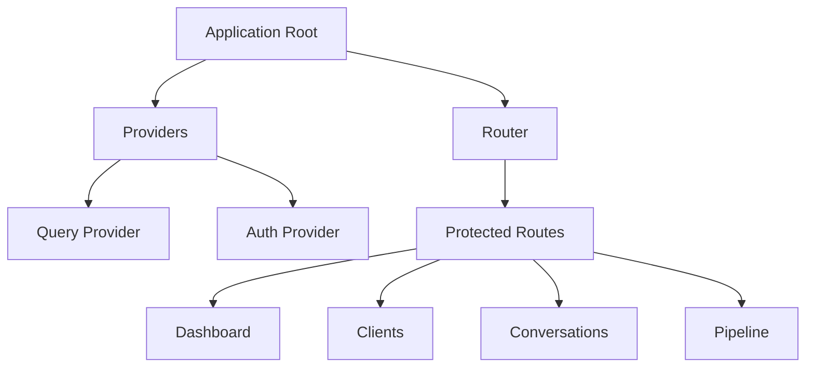

## Frontend Engineering Decisions

### Feature-Based Organization

Business logic is grouped by application domain instead of grouping files only by type.

Benefits:

* easier scalability
* cleaner separation of concerns
* simplified maintenance
* improved developer onboarding
* better long-term organization

### Centralized Providers

Core application infrastructure such as:

* authentication
* routing
* server state management

is centralized at the application root level.

This reduces architectural duplication and improves maintainability.

# 🔐 Authentication Architecture

Authentication is implemented using Supabase Auth with centralized React Context state management.

The authentication system currently includes:

* Supabase authentication integration
* global auth provider
* protected route handling
* reusable authentication hook
* persistent session management
* authenticated route redirection

## Authentication Flow Diagram

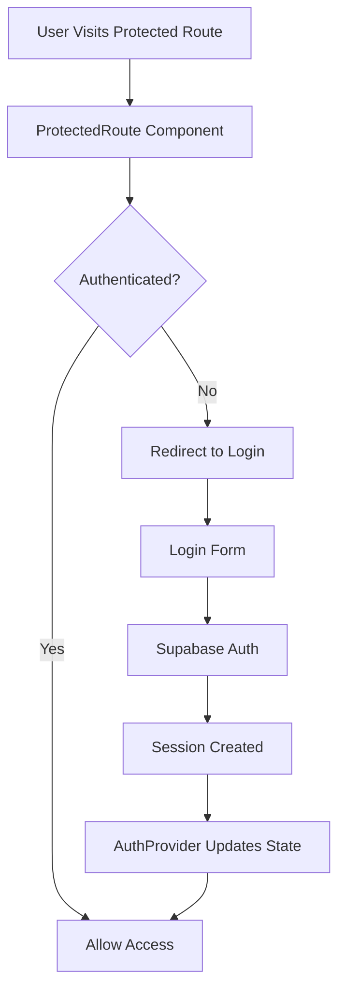

## Authentication Engineering Decisions

### Global Auth Provider

Authentication state is managed centrally using React Context.

Benefits:

* avoids prop drilling
* improves state accessibility
* enables scalable auth management
* simplifies protected route handling

### Protected Route Architecture

Protected routes are implemented to improve:

* user navigation flow
* authenticated access control
* application security UX

Important:
Frontend protection improves user experience, while backend authorization will later enforce ownership rules and role permissions.

### Session Persistence

Supabase session handling allows authenticated users to remain logged in across page refreshes and browser restarts.


# 🚀 Development Progress

## ✅ Task 1 — Project Foundation & Frontend Setup

### Objective

Establish the foundational frontend architecture and development environment for the CRM platform.

### Repository Initialization

Completed:

* created GitHub repository
* initialized Vite React TypeScript application
* configured development workspace

### Frontend Tooling Setup

Installed and configured:

* Tailwind CSS
* shadcn/ui
* React Router
* TanStack Query
* TypeScript path aliases

### Frontend Architecture Setup

Implemented scalable frontend structure:

```txt
src/
  app/
  components/
  features/
  lib/
  pages/
```

The architecture was designed early to support:

* modular scalability
* reusable business domains
* maintainable feature organization
* production-style application growth

### Supabase Integration

Completed:

* created Supabase project
* configured frontend environment variables
* integrated Supabase frontend SDK
* established frontend cloud infrastructure connection

### Task 1 Engineering Outcome

Successfully established:

* scalable frontend architecture
* cloud backend integration
* reusable project structure
* frontend infrastructure foundation
* development-ready environment

## ✅ Task 2 — Authentication System Implementation

### Objective

Implement secure authentication infrastructure with protected route handling and persistent session management.

### Authentication Infrastructure

Implemented:

* AuthProvider
* useAuth hook
* protected route architecture
* centralized auth state management
* session persistence handling

### Login System

Built login interface using:

* shadcn/ui
* Tailwind CSS
* Supabase authentication methods

Features implemented:

* email/password authentication
* loading state handling
* authentication error handling
* redirect after login
* persistent user sessions

### Protected Route System

Implemented route-level authentication protection.

Behavior:

```txt
Unauthenticated User → Redirect to /login
Authenticated User → Allow Dashboard Access
```

### Authentication Architecture Diagram

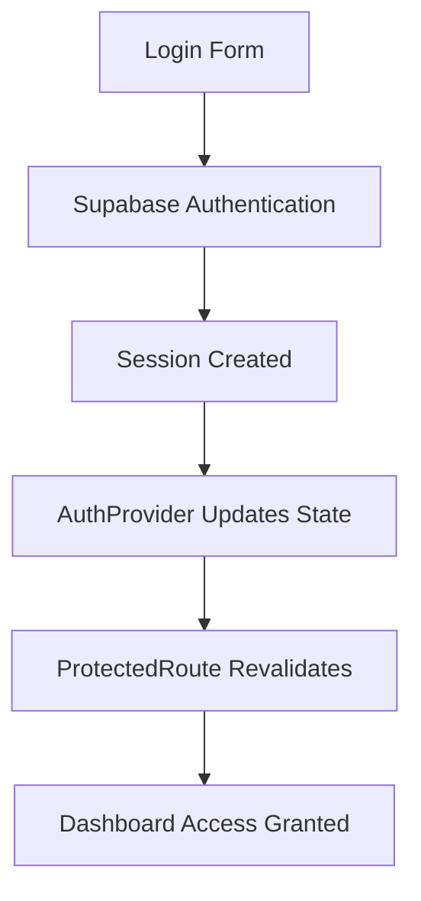

## Authentication Interface Preview

### Login Interface

The login page was implemented using:

- shadcn/ui
- Tailwind CSS
- Supabase authentication flow

The interface provides a clean authentication experience with protected route integration and session-aware authentication handling.


### Protected Dashboard Access

Authenticated users are redirected to protected application routes after successful authentication.

The dashboard route is protected using centralized authentication state validation through the `ProtectedRoute` component.


## Real Engineering Debugging Encountered

During implementation, modern TypeScript + Vite runtime issues were encountered involving:

```ts
import type
```

The issue was resolved by correctly separating:

* runtime imports
* TypeScript-only type imports

This debugging process reinforced understanding of:

* ESM modules
* Vite runtime behavior
* TypeScript type imports
* frontend debugging workflow

## Task 2 Engineering Outcome

Successfully implemented:

* authentication architecture
* protected routing system
* centralized auth management
* persistent session handling
* functional login workflow
* authenticated dashboard access

## ✅ Task 3 — Application Layout System

### Objective

Build the authenticated application shell architecture for the CRM platform.

This task establishes the foundational dashboard experience used across authenticated areas of the application.

The goal of this phase was to implement:

* reusable layout architecture
* sidebar navigation system
* authenticated application shell
* scalable route structure
* centralized navigation management
* production-style dashboard layout

## Application Layout Architecture

The application layout system was designed using reusable layout components to ensure scalability and maintainability as the CRM grows.

Implemented layout components:

```txt
components/layout/
├── app-layout.tsx
├── app-sidebar.tsx
└── app-header.tsx
```

## Implemented Features

### Sidebar Navigation System

Built a reusable sidebar navigation architecture using:

* shadcn/ui sidebar components
* React Router navigation
* Lucide React icons
* centralized navigation configuration

Navigation sections implemented:

* Dashboard
* Clients
* Conversations
* Deals
* Settings

### Centralized Navigation Configuration

Navigation items were abstracted into:

```txt
lib/navigation/navigation.config.ts
```

This approach avoids hardcoded navigation logic directly inside UI components.

Benefits:

* easier scalability
* reusable navigation rendering
* cleaner sidebar architecture
* easier future role-based access implementation
* improved maintainability

### Application Header System

Implemented reusable authenticated header containing:

* application title
* platform description
* logout functionality

Logout handling is connected directly to:

```ts
supabase.auth.signOut()
```

This automatically:

* clears user session
* updates AuthProvider state
* revalidates protected routes
* redirects users to login

### Authenticated Application Shell

Built reusable application shell architecture using:

```tsx
<AppLayout>
```

The layout provides:

* sidebar rendering
* responsive application structure
* shared authenticated UI
* centralized page rendering

All protected application pages now render inside the shared application shell.

## Layout Rendering Architecture

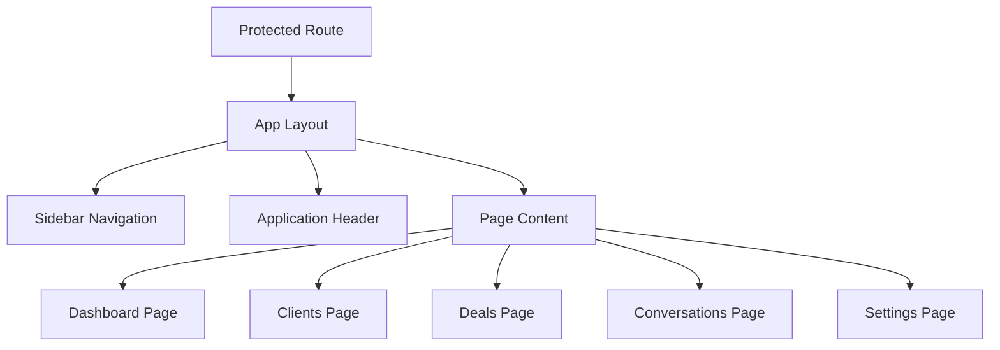
## Navigation Rendering Architecture

The sidebar navigation uses configuration-driven rendering.

```tsx
navigationItems.map()
```

This pattern enables scalable SaaS-style navigation systems commonly used in production dashboard applications.

Benefits include:

* dynamic navigation rendering
* centralized navigation logic
* future permission-aware routing
* reusable UI architecture

## Route Architecture

Protected application routes were expanded to support multiple authenticated pages.

Implemented routes:

```txt
/
/clients
/conversations
/deals
/settings
/login
```

Each protected route now follows layered architecture:

```tsx
<ProtectedRoute>
  <AppLayout>
    <Page />
  </AppLayout>
</ProtectedRoute>
```

## Engineering Decisions

### Reusable Layout Pattern

Instead of building navigation separately inside each page, a shared layout system was implemented.

Benefits:

* consistent UI structure
* scalable frontend architecture
* simplified page management
* reduced duplicated layout code

### Configuration-Driven Navigation

Navigation logic was separated from rendering logic.

This improves:

* maintainability
* scalability
* future role-based authorization support
* frontend architecture organization

### Component-Based Layout Design

The dashboard shell was broken into isolated components:

* sidebar
* header
* layout wrapper

This follows separation of concerns principles commonly used in scalable frontend systems.

## Task 3 Screenshots

### Authenticated Dashboard Layout


### Sidebar Navigation System


## Task 3 Outcome

Successfully implemented:

* authenticated application shell
* reusable layout architecture
* scalable sidebar navigation
* centralized navigation configuration
* responsive dashboard structure
* multi-page protected route system
* reusable SaaS-style frontend foundation

## ✅ Task 4 — Client Management System

### Objective

Implement a production-style client management workflow with authenticated CRUD-ready architecture, realtime UI synchronization, Supabase persistence, and scalable frontend data handling.

## Client Management Architecture

Implemented scalable client management infrastructure using:

* feature-based frontend architecture
* Supabase database integration
* React Query server-state management
* reusable service-layer architecture
* authenticated data workflows
* protected business routes

## Client Feature Structure

```txt
src/features/clients
├── components
├── hooks
│   └── use-clients.ts
├── services
│   └── client.service.ts
└── types
    └── client.types.ts
```

### Engineering Purpose

The client module was separated into:

| Layer | Responsibility |
|---|---|
| hooks | React Query business logic |
| services | database communication |
| types | centralized TypeScript contracts |
| components | reusable feature UI |

This architecture improves:

* scalability
* maintainability
* separation of concerns
* future feature expansion

## Database Integration

A dedicated `clients` table was created in Supabase PostgreSQL.

### Database Fields

| Column | Purpose |
|---|---|
| id | unique identifier |
| full_name | client name |
| email | client email |
| phone | contact number |
| company | organization |
| status | pipeline status |
| created_at | creation timestamp |

## Supabase Row Level Security (RLS)

Production-style database authorization was implemented using Supabase RLS policies.

### Policies Configured

| Policy | Purpose |
|---|---|
| SELECT policy | authenticated client retrieval |
| INSERT policy | authenticated client creation |

### Engineering Importance

RLS ensures:

* protected database access
* authenticated business operations
* backend-level authorization
* secure multi-user scalability

This reflects real SaaS security architecture where database authorization exists independently of frontend validation.

## React Query Integration

React Query was implemented for server-state management.

### Features Implemented

* automatic data fetching
* mutation handling
* cache synchronization
* optimistic UI refresh behavior
* loading state handling

### Data Flow Architecture

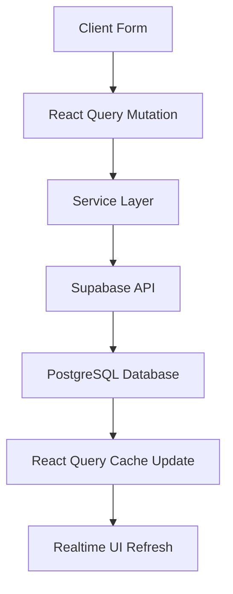

## Client Creation Workflow

Authenticated users can create new CRM client records directly from the dashboard interface.

### Features Implemented

* client onboarding form
* authenticated database insertion
* realtime table synchronization
* loading state handling
* success notifications
* validation handling
* reusable UI architecture

## Form Validation System

Frontend validation was implemented to improve UX quality and prevent invalid submissions.

### Validation Rules

* required full name
* required email
* email input typing
* disabled loading states

### Validation UX

Invalid submissions immediately trigger frontend feedback before database requests are executed.

## Toast Notification System

Professional toast notifications were implemented using:

```txt
sonner
```

### Notification Types

| Notification | Purpose |
|---|---|
| success toast | successful client creation |
| error toast | failed operation handling |
| validation toast | invalid form feedback |

### Engineering Benefit

This improves:

* UX responsiveness
* operational clarity
* user confidence
* production-level interaction flow

## Status Badge System

Client statuses were upgraded from plain text into reusable badge components.

### Current Status Support

* lead

### Future Expandability

The architecture now supports scalable CRM pipeline stages such as:

* qualified
* proposal
* negotiation
* won
* lost

## Client Management Interface

The application now supports authenticated client onboarding with realtime synchronization between the frontend and Supabase PostgreSQL.


## Validation Workflow

Frontend validation prevents incomplete submissions and improves operational usability.


## Engineering Decisions

### Feature-Based Module Design

The client system was implemented as an isolated feature module instead of placing all logic in page-level files.

Benefits:

* cleaner architecture
* easier onboarding for contributors
* scalable business-domain separation
* improved maintainability

### Service Layer Abstraction

Database logic was separated into dedicated services.

Benefits:

* reusable API logic
* cleaner React components
* easier backend replacement
* testability improvements

### React Query Adoption

React Query was selected over manual fetch/state management because it provides:

* automatic cache handling
* scalable async workflows
* simplified loading states
* improved frontend scalability

## Real Engineering Debugging Encountered

During implementation, Supabase Row Level Security initially blocked authenticated inserts.

This issue was resolved by correctly configuring:

* SELECT policies
* INSERT policies
* authenticated role permissions

This debugging process reinforced understanding of:

* database authorization
* backend security architecture
* Supabase RLS workflows
* frontend-to-database request pipelines

## Task 4 Engineering Outcome

Successfully implemented:

* authenticated client onboarding
* React Query architecture
* Supabase database persistence
* secure RLS authorization
* scalable feature module design
* realtime UI synchronization
* validation workflows
* toast notification system
* reusable status badge system
* production-style CRM data flow

## ✅ Task 5 — Deal Pipeline System

### Objective

Implement a scalable CRM deal pipeline system using a Kanban-style workflow architecture for visual sales tracking and stage-based client management.

## Deal Pipeline Architecture

Implemented a reusable pipeline board system using modular frontend component architecture to support scalable CRM workflow visualization.

### Pipeline Structure

The CRM pipeline is divided into the following stages:

```txt
Lead
Qualified
Proposal
Won
Lost
```

Each client deal is dynamically grouped and rendered according to its current pipeline status.

## Pipeline Component Architecture

Implemented modular reusable pipeline components:

```txt
src/features/deals/
└── components
    ├── deal-card.tsx
    ├── pipeline-board.tsx
    └── pipeline-column.tsx
```

### Component Responsibilities

| Component             | Responsibility                  |
| --------------------- | ------------------------------- |
| `pipeline-board.tsx`  | orchestrates pipeline rendering |
| `pipeline-column.tsx` | renders grouped stage columns   |
| `deal-card.tsx`       | renders reusable CRM deal cards |

## Kanban-Style Workflow System

Implemented dynamic pipeline rendering architecture with the following capabilities:

* stage-based deal grouping
* dynamic deal counters
* reusable card rendering
* responsive pipeline columns
* scalable SaaS dashboard structure
* modular workflow architecture

## Deal Card System

Each CRM deal card displays:

* client full name
* email address
* company information
* pipeline status badge

The reusable card architecture supports future enhancements such as:

* drag-and-drop interactions
* deal ownership assignment
* activity tracking
* realtime updates
* revenue forecasting

## Pipeline Rendering Logic

Client records are dynamically grouped by:

```ts
status
```

Pipeline columns automatically update based on:

* Supabase database records
* React Query state updates
* frontend state synchronization

## CRM Workflow Architecture

### Deal Lifecycle Flow

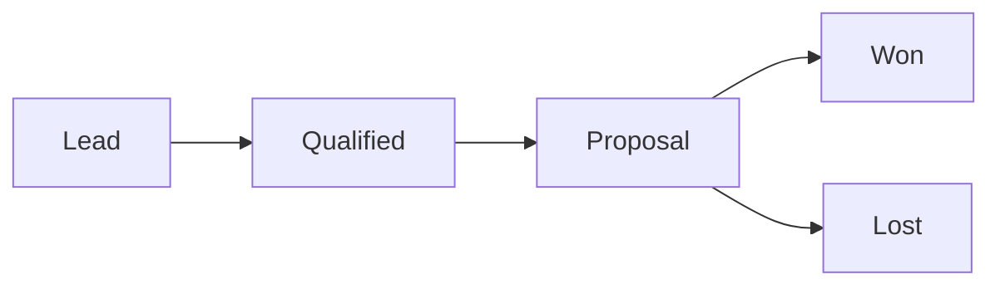

This workflow mirrors modern SaaS CRM sales pipelines used in production systems.

## Responsive SaaS Dashboard Integration

The deal pipeline integrates directly into the authenticated application layout system.

Implemented features include:

* responsive sidebar layout
* scalable dashboard spacing
* reusable dashboard containers
* responsive pipeline columns
* consistent SaaS interface styling

## Pipeline Board Screenshot

### Full Deal Pipeline Board


This screenshot demonstrates:

* dynamic stage rendering
* distributed deal management
* Kanban-style workflow visualization
* reusable CRM deal architecture
* responsive dashboard integration

## Engineering Decisions

### Modular Pipeline Architecture

The pipeline system was intentionally separated into reusable components to improve:

* maintainability
* scalability
* UI consistency
* future extensibility

This architecture supports future enhancements such as:

* drag-and-drop workflows
* realtime collaboration
* deal analytics
* role-aware permissions

### Configuration-Driven Workflow Rendering

Pipeline stages are rendered dynamically instead of hardcoding UI sections.

Benefits include:

* simplified maintenance
* easier workflow expansion
* centralized pipeline configuration
* scalable frontend logic

## Real Engineering Challenges Encountered

During implementation, a database schema issue was identified involving:

```txt
missing PRIMARY KEY configuration
```

This prevented Supabase row updates from functioning correctly.

The issue was resolved by properly configuring the database table with a primary key constraint.

This debugging process reinforced understanding of:

* relational database design
* primary key architecture
* Supabase table constraints
* production database requirements

## Task 5 Engineering Outcome

Successfully implemented:

* CRM pipeline board architecture
* Kanban-style workflow rendering
* reusable deal card components
* dynamic status grouping
* responsive pipeline visualization
* scalable SaaS dashboard workflow
* modular frontend structure
* production-style CRM pipeline UI

## ✅ Task 6 — Realtime Conversations System

### Objective

Implement a realtime CRM communication system using Supabase Realtime subscriptions and event-driven frontend synchronization.

This phase introduced:

* live messaging architecture
* realtime database subscriptions
* relational conversation modeling
* event-driven UI updates
* production-style communication workflows

## Realtime Conversations Architecture

Implemented a fully modular conversations feature architecture:

```txt id="cv61"
src/features/conversations
├── components
│   ├── conversation-list.tsx
│   ├── conversation-thread.tsx
│   └── message-input.tsx
├── hooks
│   └── use-conversations.ts
├── services
│   └── conversation.service.ts
└── types
    └── conversation.types.ts
```

### Architecture Goals

* isolate realtime business logic
* maintain scalable feature boundaries
* separate UI from data operations
* centralize Supabase communication
* improve maintainability
* preserve TypeScript strict typing

## Realtime Messaging Infrastructure

Implemented:

* realtime conversation threads
* live message synchronization
* Supabase realtime subscriptions
* active conversation selection
* instant UI updates without refresh
* relational client-to-message architecture

## Conversation Database Architecture

Created a relational conversations table linked to CRM clients.

### Conversations Table Structure

```sql id="cv62"
CREATE TABLE conversations (
  id UUID DEFAULT gen_random_uuid() PRIMARY KEY,

  client_id UUID REFERENCES clients(id) ON DELETE CASCADE,

  message TEXT NOT NULL,

  sender TEXT NOT NULL,

  created_at TIMESTAMP WITH TIME ZONE DEFAULT timezone('utc', now())
);
```

## Row Level Security Configuration

Enabled production-style database security using Supabase Row Level Security (RLS).

Implemented policies for:

* authenticated message reads
* authenticated message inserts

### Security Policies

```sql id="cv63"
CREATE POLICY "Allow authenticated selects"
ON conversations
FOR SELECT
TO authenticated
USING (true);

CREATE POLICY "Allow authenticated inserts"
ON conversations
FOR INSERT
TO authenticated
WITH CHECK (true);
```

## Realtime Event Flow

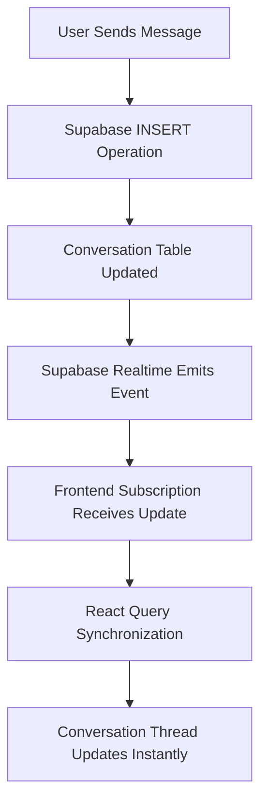

This architecture enables realtime communication without requiring manual browser refreshes.

## Realtime Synchronization Workflow

### Initial Data Fetching

Handled using:

* TanStack Query
* centralized query hooks
* reusable service-layer requests

### Live Realtime Updates

Handled using:

* Supabase realtime subscriptions
* INSERT event listeners
* reactive frontend synchronization

This hybrid architecture combines:

* efficient API-driven data loading
* realtime reactive event updates
* scalable frontend state management

## Conversation Interface

Built a split-panel CRM messaging interface containing:

### Client Conversation Navigation

Features:

* client conversation selection
* conversation relationship mapping
* message count rendering
* active conversation highlighting

### Active Conversation Thread

Features:

* live message rendering
* realtime updates
* responsive conversation layout
* conversation history display

### Message Input System

Features:

* realtime message creation
* Supabase INSERT operations
* reactive thread updates
* reusable input component architecture

## Screenshot — Realtime Conversations Dashboard


This interface demonstrates:

* realtime CRM communication workflows
* relational client messaging
* event-driven UI synchronization
* modular conversation architecture
* responsive SaaS messaging design

## Real Engineering Challenges Encountered

During implementation, realtime synchronization issues were encountered involving:

* missing conversations table configuration
* relational schema setup
* Row Level Security policies
* Supabase permission management
* realtime subscription initialization

### Initial Conversation Loading Failure

Before the conversations table and RLS policies were configured correctly, the frontend failed to load realtime data properly.

This debugging process reinforced understanding of:

* relational database architecture
* Supabase security workflows
* realtime subscription systems
* event-driven frontend behavior
* backend/frontend synchronization debugging

### Debugging Screenshot


## Engineering Decisions

### Feature-Based Realtime Isolation

Realtime messaging logic was isolated inside:

```txt id="cv64"
features/conversations
```

Benefits:

* scalable architecture
* easier debugging
* reusable realtime logic
* maintainable feature ownership

### Service Layer Separation

Supabase operations were isolated into:

```txt id="cv65"
conversation.service.ts
```

Benefits:

* clean component architecture
* centralized backend communication
* reusable database operations
* improved maintainability

### Hook-Based Realtime Management

Realtime subscriptions and query synchronization were centralized inside:

```txt id="cv66"
use-conversations.ts
```

Benefits:

* simplified subscription lifecycle management
* reusable realtime hooks
* cleaner UI components
* scalable synchronization architecture

## Task 6 Engineering Outcome

Successfully implemented:

* realtime conversation infrastructure
* Supabase realtime subscriptions
* live frontend synchronization
* relational messaging architecture
* event-driven UI updates
* scalable conversation workflows
* production-style security policies
* modular realtime feature architecture


## ✅ Task 7 — Role-Based Authorization System

### Objective

Implement scalable role-based authorization architecture for the CRM platform using Supabase profiles, protected routes, and permission-aware frontend rendering.

This phase introduces:

* enterprise access control
* role-aware navigation
* protected authorization routes
* dynamic UI rendering based on permissions
* scalable authorization infrastructure

## Authorization Architecture

Implemented a role-based authorization system layered on top of the existing authentication infrastructure.

Supported roles:

```txt id="rdd71"
admin
sales
manager
```

## Profiles Database Architecture

Created a dedicated `profiles` table linked to Supabase authenticated users.

### Profiles Table Schema

```sql id="rdd72"
CREATE TABLE profiles (
  id UUID PRIMARY KEY REFERENCES auth.users(id) ON DELETE CASCADE,

  role TEXT NOT NULL DEFAULT 'sales',

  created_at TIMESTAMP WITH TIME ZONE DEFAULT timezone('utc', now())
);
```

## Authorization Flow

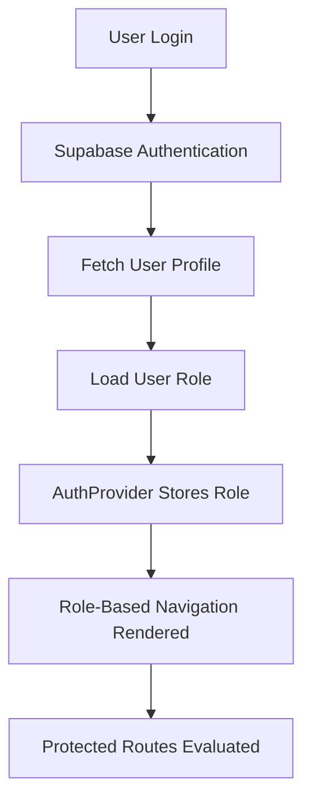

## Authorization Infrastructure

Implemented:

* role-aware authentication state
* centralized role management
* protected role routes
* permission-based sidebar rendering
* unauthorized route protection
* reusable authorization utilities

## Feature Architecture

Implemented reusable authorization infrastructure inside:

```txt id="rdd73"
src/features/auth
├── components
│   ├── protected-route.tsx
│   └── role-protected-route.tsx
├── providers
│   └── auth-provider.tsx
├── utils
│   └── role-check.ts
```

## Authorization System Architecture

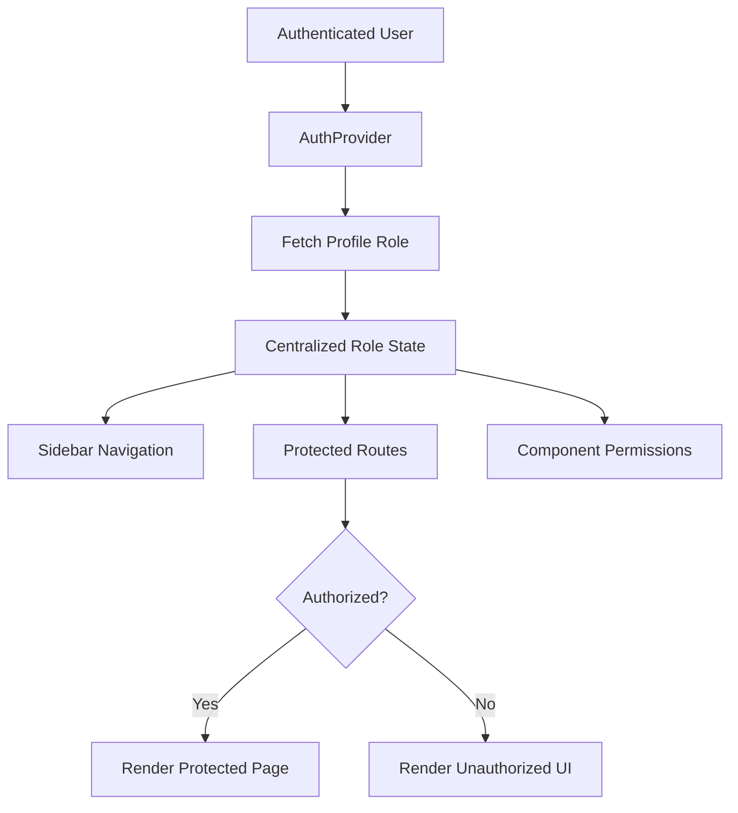

## Role-Based Sidebar Navigation

The application sidebar now dynamically renders based on authenticated user permissions.

### Admin Navigation Access

Admin users can access:

* dashboard
* clients
* conversations
* deals
* settings

### Sales Navigation Access

Sales users can access:

* dashboard
* clients
* conversations
* deals

Sales users are restricted from accessing:

```txt id="rdd74"
settings
```

## Screenshot — Admin Sidebar Access


## Screenshot — Sales Restricted Sidebar


## Settings Module UI Enhancement

Improved the protected settings module to provide a more realistic SaaS-style account management experience.

Previously, the settings route only rendered a basic placeholder heading.

The module was enhanced with:

* account settings layout
* role visibility
* access level display
* account status section
* future settings roadmap section
* enterprise-style settings presentation

This improved:

* UI professionalism
* application consistency
* SaaS platform realism
* portfolio quality
* protected route experience

## Screenshot — Account Settings Module


## Route-Level Authorization Protection

Implemented protected authorization wrappers to prevent unauthorized users from manually accessing restricted routes.

Example:

```txt id="rdd75"
/settings
```

is protected using role-based route validation.

## Unauthorized Access Flow

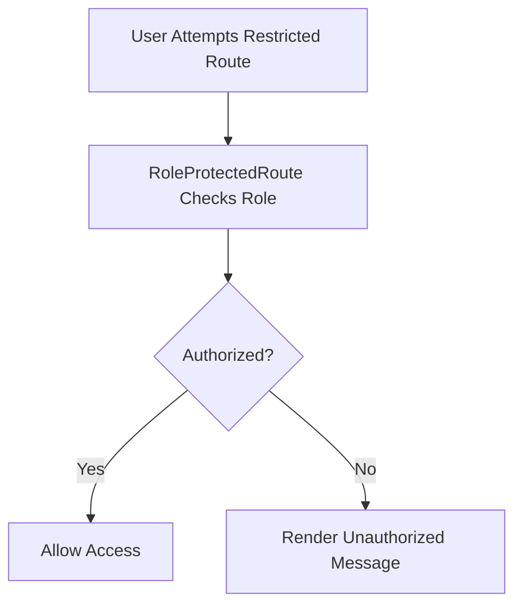

## Screenshot — Unauthorized Route Protection


## Row Level Security Policies

Implemented secure profile access using Supabase Row Level Security.

### Profile Policies

```sql id="rdd76"
CREATE POLICY "Allow authenticated profile reads"
ON profiles
FOR SELECT
TO authenticated
USING (true);

CREATE POLICY "Allow authenticated profile inserts"
ON profiles
FOR INSERT
TO authenticated
WITH CHECK (true);

CREATE POLICY "Allow authenticated profile updates"
ON profiles
FOR UPDATE
TO authenticated
USING (true);
```

## Engineering Decisions

### Separation of Authentication and Authorization

Authentication and authorization were intentionally separated.

Authentication handles:

```txt id="rdd77"
Who is the user?
```

Authorization handles:

```txt id="rdd78"
What is the user allowed to access?
```

This separation improves:

* scalability
* maintainability
* enterprise readiness
* cleaner architecture boundaries

## Centralized Role Management

User role information is managed inside:

```txt id="rdd79"
AuthProvider
```

Benefits:

* avoids prop drilling
* enables global permission checks
* simplifies authorization logic
* centralizes role state

## Reusable Authorization Utilities

Reusable authorization helpers were isolated inside:

```txt id="rdd710"
role-check.ts
```

Benefits:

* cleaner conditional rendering
* reusable permission logic
* scalable access control architecture
* maintainable authorization workflows

## Protected Route Enforcement

Authorization was enforced at:

* sidebar navigation level
* route level
* component rendering level

This prevents unauthorized users from bypassing UI restrictions by manually typing protected URLs.

## Real Engineering Challenges Encountered

During implementation, several enterprise authorization concerns were encountered involving:

* user role synchronization
* protected route validation
* dynamic sidebar rendering
* Supabase profile integration
* authorization state management
* protected settings rendering
* permission-aware UI architecture

This debugging process reinforced understanding of:

* enterprise access control
* permission-aware frontend architecture
* protected route systems
* authorization middleware patterns
* role-based UI rendering

## Task 7 Engineering Outcome

Successfully implemented:

* scalable authorization architecture
* role-based access control
* protected authorization routes
* permission-aware navigation
* centralized role management
* enterprise-style access workflows
* dynamic sidebar rendering
* unauthorized access protection
* protected SaaS settings module
* permission-aware account management UI

## ✅ Task 8 — CRM Analytics Dashboard

### Objective

Transform the existing static dashboard into a live CRM analytics and business intelligence platform powered by Supabase.

This phase introduced:

* real-time CRM metrics
* business analytics dashboards
* pipeline visualization
* KPI tracking
* operational visibility
* SaaS-style dashboard architecture

## Analytics Dashboard Overview

Implemented a professional analytics dashboard capable of displaying live CRM operational insights.

The dashboard now provides visibility into:

* total clients
* active leads
* won deals
* lost deals
* conversation activity
* pipeline distribution
* recent CRM activity

## Dashboard Architecture

The analytics system was designed using modular frontend architecture principles.

### Dashboard Structure

```txt id="ta81"
Dashboard
├── KPI Analytics Cards
├── Deal Distribution Chart
├── Pipeline Stage Chart
├── Recent Client Activity
└── Live CRM Metrics
```

## Dashboard Analytics Lifecycle

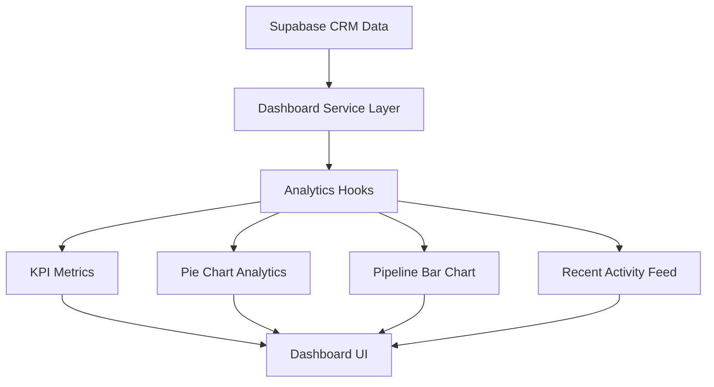

This architecture improves:

* analytics separation of concerns
* reusable dashboard logic
* scalable analytics rendering
* centralized data aggregation

## Dashboard Feature Structure

```txt id="ta82"
src/features/dashboard
├── components
│   ├── analytics-card.tsx
│   ├── analytics-dashboard.tsx
│   ├── deal-distribution-chart.tsx
│   ├── kpi-summary.tsx
│   ├── pipeline-stage-chart.tsx
│   └── recent-client-activity.tsx
├── hooks
│   └── use-dashboard-analytics.ts
├── services
│   └── dashboard.service.ts
└── types
    └── dashboard.types.ts
```

## Feature Architecture Breakdown

### Components Layer

Responsible for visual analytics rendering.

| Component                   | Responsibility               |
| --------------------------- | ---------------------------- |
| analytics-card.tsx          | reusable KPI metric cards    |
| analytics-dashboard.tsx     | dashboard composition layout |
| deal-distribution-chart.tsx | pie chart visualization      |
| kpi-summary.tsx             | KPI metrics section          |
| pipeline-stage-chart.tsx    | bar chart analytics          |
| recent-client-activity.tsx  | activity feed rendering      |

### Hooks Layer

```txt id="ta83"
use-dashboard-analytics.ts
```

Responsible for:

* analytics data fetching
* React Query integration
* dashboard state management
* async loading handling

This improves:

* separation of concerns
* scalability
* reusable business logic

### Services Layer

```txt id="ta84"
dashboard.service.ts
```

Responsible for:

* centralized Supabase queries
* analytics aggregation
* dashboard data abstraction
* reusable analytics services

This prevents:

```txt id="ta85"
scattered database queries across UI components
```

### Types Layer

```txt id="ta86"
dashboard.types.ts
```

Responsible for:

* TypeScript analytics modeling
* dashboard type safety
* reusable analytics interfaces
* strongly typed business metrics

## KPI Summary Cards

Implemented reusable analytics cards displaying live CRM business statistics.

### KPI Metrics

| Metric              | Description                          |
| ------------------- | ------------------------------------ |
| Total Clients       | Total registered CRM clients         |
| Active Leads        | Clients currently in lead stage      |
| Won Deals           | Successfully converted opportunities |
| Lost Deals          | Failed or closed opportunities       |
| Total Conversations | CRM communication activity           |

## Screenshot — CRM Analytics Overview


## Business Intelligence Concepts Implemented

This task introduced:

# derived business analytics.

Metrics are dynamically computed from database records instead of being manually stored.

Example:

```txt id="ta87"
Won Deals = clients where status === "won"
```

This demonstrates:

* live business aggregation
* operational analytics
* real-time business visibility
* dynamic metric computation

## Deal Distribution Visualization

Implemented analytics visualization using:

```txt id="ta88"
Pie Chart
```

The chart visualizes CRM pipeline distribution across:

* lead
* qualified
* proposal
* won
* lost

This provides quick visibility into CRM pipeline health.

## Pipeline Stage Analytics

Implemented:

```txt id="ta89"
Bar Chart
```

for pipeline stage comparison.

This enables:

* stage performance analysis
* opportunity tracking
* operational visibility
* CRM sales monitoring

## Recent Client Activity Feed

Implemented a live activity feed displaying:

* client full name
* company
* pipeline status
* creation timestamps

This simulates activity systems commonly found in enterprise SaaS platforms.

## Screenshot — Recent Client Activity


## Supabase Analytics Integration

Dashboard analytics are dynamically aggregated from Supabase tables.

### Database Sources

| Table         | Purpose                 |
| ------------- | ----------------------- |
| clients       | CRM pipeline metrics    |
| conversations | communication analytics |

## Live Analytics Behavior

Dashboard metrics automatically update when:

* new clients are created
* client statuses change
* conversations increase
* pipeline distribution changes

This demonstrates:

* reactive frontend systems
* live business analytics
* realtime-ready architecture

## Responsive Dashboard Design

Implemented responsive dashboard layouts using:

* TailwindCSS grid system
* responsive analytics cards
* scalable chart containers
* reusable dashboard sections

The dashboard adapts properly across:

* desktop screens
* tablets
* different viewport sizes

## Loading and Empty States

Implemented production-style async handling for:

* analytics loading states
* empty datasets
* fetch failures
* fallback UI rendering

This improves:

* reliability
* user experience
* production readiness

## Frontend Engineering Concepts Learned

Task 8 introduced several important engineering concepts:

### Business Intelligence UI

Understanding how enterprise dashboards provide operational visibility.

### Analytics Aggregation

Transforming raw relational data into meaningful business metrics.

### Data Visualization

Presenting CRM performance using charts and visual analytics.

### Derived Application State

Computing analytics dynamically instead of storing static metric values.

### Modular Dashboard Architecture

Building scalable analytics systems using reusable frontend modules.

## Real Engineering Challenges Encountered

During implementation, several frontend engineering concerns were handled:

* chart rendering
* analytics aggregation logic
* responsive dashboard layouts
* Supabase analytics queries
* reusable KPI systems
* async dashboard rendering
* modular analytics architecture

This improved understanding of:

* SaaS analytics systems
* frontend dashboard engineering
* business intelligence rendering
* modular React architecture
* operational visualization systems

## Task 8 Engineering Outcome

Successfully implemented:

* live CRM analytics dashboard
* KPI business metrics
* pie chart visualization
* pipeline analytics charts
* recent activity feeds
* Supabase-powered aggregation
* responsive dashboard architecture
* reusable analytics components
* SaaS-style business intelligence UI
* enterprise dashboard workflows

## ✅ Task 9 — Backend API Layer with Hono + Cloudflare Workers

### Objective

Build a scalable backend API layer for the Student CRM Platform using Hono and Cloudflare Workers.

This phase transformed the project from a frontend-driven CRM application into a true full stack SaaS platform by introducing:

* backend API architecture
* middleware systems
* request validation
* backend authorization
* service layer abstraction
* Cloudflare Workers runtime
* modular API routing

## Backend API Overview

Implemented a production-style backend API layer responsible for:

* handling API requests
* validating incoming requests
* protecting backend resources
* centralizing business logic
* communicating securely with Supabase
* standardizing API responses

The backend now acts as a middleware layer between:

```txt id="tb91"
Frontend Application
        ↓
Hono API Layer
        ↓
Supabase Database
```

## Backend Architecture

The backend architecture was designed using modular service-oriented principles.

### Backend Request Lifecycle

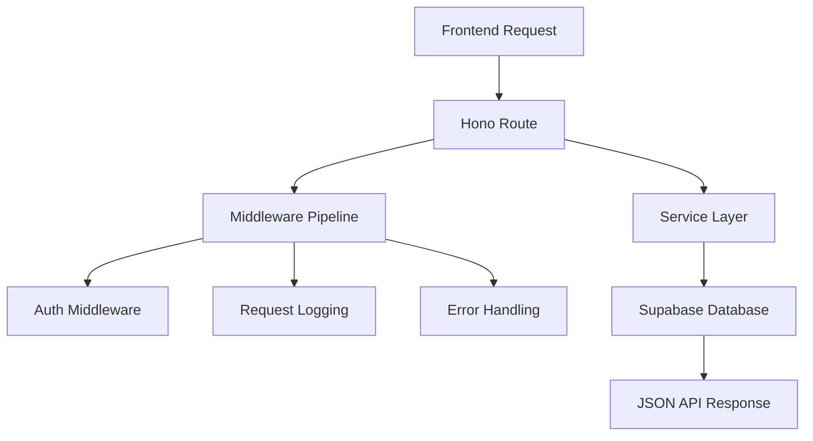

This architecture improves:

* scalability
* maintainability
* backend separation of concerns
* enterprise API organization

## Backend Feature Structure

```txt id="tb92"
worker/src
├── index.ts
├── lib
│   ├── api-response.ts
│   ├── http-error.ts
│   ├── supabase.ts
│   └── validation.ts
├── middleware
│   ├── auth.ts
│   ├── error-handling.ts
│   └── request-logging.ts
├── routes
│   ├── clients.ts
│   ├── conversations.ts
│   └── dashboard.ts
├── services
│   ├── client.service.ts
│   ├── conversation.service.ts
│   └── dashboard.service.ts
└── types
    ├── api.ts
    ├── domain.ts
    └── env.ts
```

## Backend Architecture Breakdown

### Middleware Layer

Responsible for request processing and backend protection.

| Middleware         | Responsibility             |
| ------------------ | -------------------------- |
| auth.ts            | bearer token validation    |
| error-handling.ts  | centralized backend errors |
| request-logging.ts | request lifecycle logging  |

This introduced:

* backend request pipelines
* centralized error management
* API authorization enforcement

### Routes Layer

Responsible for API endpoint handling.

Implemented routes:

| Route File       | Responsibility             |
| ---------------- | -------------------------- |
| clients.ts       | client API endpoints       |
| conversations.ts | conversation API endpoints |
| dashboard.ts     | analytics API endpoints    |

Implemented API routes:

| Endpoint             | Method | Purpose                   |
| -------------------- | ------ | ------------------------- |
| `/api/clients`       | GET    | fetch CRM clients         |
| `/api/clients`       | POST   | create clients            |
| `/api/conversations` | GET    | fetch conversations       |
| `/api/conversations` | POST   | create conversations      |
| `/api/dashboard`     | GET    | fetch dashboard analytics |

### Services Layer

```txt id="tb93"
services/
```

Responsible for:

* Supabase database operations
* business logic abstraction
* reusable backend services
* centralized backend logic

This prevents:

```txt id="tb94"
database queries scattered directly inside routes
```

The backend follows:

```txt id="tb95"
Routes
↓
Services
↓
Supabase
```

This improves:

* scalability
* maintainability
* backend organization
* testing readiness

### Shared Library Layer

```txt id="tb96"
lib/
```

Responsible for reusable backend utilities.

| Utility         | Responsibility              |
| --------------- | --------------------------- |
| api-response.ts | standardized JSON responses |
| http-error.ts   | reusable HTTP errors        |
| supabase.ts     | backend Supabase client     |
| validation.ts   | request validation helpers  |

This introduced:

* reusable backend utilities
* standardized API formatting
* centralized backend helpers

### Types Layer

```txt id="tb97"
types/
```

Responsible for:

* API response typing
* domain entity typing
* environment variable typing
* backend TypeScript safety

This improves:

* type safety
* maintainability
* backend reliability
* scalable API contracts

## Validation System

Implemented reusable backend validation utilities to:

* validate incoming payloads
* sanitize request data
* prevent malformed requests
* standardize backend validation workflows

This introduced:

## request validation architecture.

## Environment Configuration

Configured backend environment variables for secure Supabase communication.

### Environment Variables

```env
SUPABASE_URL=
SUPABASE_SERVICE_ROLE_KEY=
```

These variables allow the backend Worker to securely communicate with Supabase services.

## Worker Runtime Verification

The backend Worker runtime was successfully started using Wrangler.

### Development Command

```bash
npm run dev
```

### Runtime Output

```txt id="tb98"
Ready on http://localhost:8787
```

This confirmed:

* Hono initialization
* Cloudflare Worker runtime
* backend server startup
* local API readiness

## Screenshot — Worker Runtime


## API Security Verification

Protected backend routes were successfully tested.

### Example Endpoint

```txt id="tb99"
http://localhost:8787/api/clients
```

### Unauthorized API Response

```json
{
  "success": false,
  "error": {
    "code": "UNAUTHORIZED",
    "message": "Missing bearer token."
  }
}
```

This verified:

* auth middleware execution
* protected route enforcement
* backend authorization handling
* standardized API error responses

## Screenshot — Unauthorized API Response

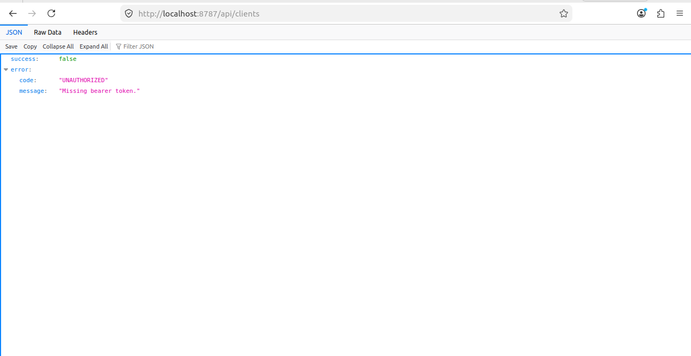

## Screenshot — Backend Architecture Structure


## Backend Engineering Concepts Learned

Task 9 introduced several important backend engineering concepts:

### Middleware Pipelines

Understanding how backend requests pass through layered middleware systems.

### Service Layer Abstraction

Separating route handling from business logic and database operations.

### API Standardization

Building reusable and consistent API response structures.

### Backend Authorization

Protecting API resources using authentication middleware.

### Cloudflare Workers Runtime

Running scalable backend APIs using edge-based serverless infrastructure.

### Request Lifecycle Architecture

Understanding how requests flow through:

```txt id="tb910"
Request
↓
Middleware
↓
Routes
↓
Services
↓
Database
↓
Response
```

## Real Engineering Challenges Encountered

During implementation, several backend engineering concerns were handled:

* Worker runtime initialization
* Hono route configuration
* middleware registration
* backend authorization handling
* request validation architecture
* API response standardization
* Supabase backend integration
* environment configuration
* backend folder organization

This improved understanding of:

* backend API architecture
* middleware systems
* serverless backend engineering
* scalable backend organization
* enterprise backend workflows

## Task 9 Engineering Outcome

Successfully implemented:

* Hono backend API layer
* Cloudflare Workers runtime
* modular backend architecture
* middleware request pipeline
* backend authorization system
* reusable service layer
* standardized API responses
* request validation system
* Supabase backend integration
* protected API endpoints
* scalable backend folder structure
* enterprise-style backend engineering

## ✅ Task 10 — Backend API Infrastructure with Cloudflare Workers and Hono

### Objective

Implement a scalable backend API infrastructure for the Student CRM Platform using:

* Cloudflare Workers
* Hono framework
* Supabase backend services
* protected API middleware
* centralized API architecture
* production deployment infrastructure

This phase transforms the CRM platform from a frontend-only application into a fullstack SaaS architecture with production-grade backend services.

## Backend Infrastructure Architecture

Implemented a dedicated backend service layer using:

```txt
Cloudflare Workers
````

combined with:

```txt id="3eq9n1"
Hono
```

for lightweight edge-based API routing and middleware handling.

## Core Backend Objectives

Implemented:

* scalable backend API architecture
* protected backend routes
* centralized service layer
* middleware-based request processing
* backend analytics aggregation
* production deployment infrastructure
* Supabase backend integration
* frontend/backend separation
* API-based data access workflows

## Backend Request Flow Architecture

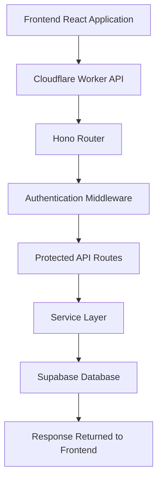

## Backend Technology Stack

### Infrastructure

```txt id="px4n3z"
Cloudflare Workers
```

Used for:

* edge runtime execution
* serverless backend hosting
* global deployment infrastructure
* API request handling

### Backend Framework

```txt id="e7x73g"
Hono
```

Used for:

* route management
* middleware architecture
* API organization
* request validation
* response handling

### Database Infrastructure

```txt id="hrj2wv"
Supabase
```

Used for:

* PostgreSQL database access
* authentication services
* realtime subscriptions
* backend data persistence

## Backend Project Architecture

Implemented dedicated backend infrastructure inside:

```txt id="q4xhlf"
worker/
├── src
│   ├── lib
│   ├── middleware
│   ├── routes
│   ├── services
│   ├── types
│   └── index.ts
```

## Backend API Route Architecture

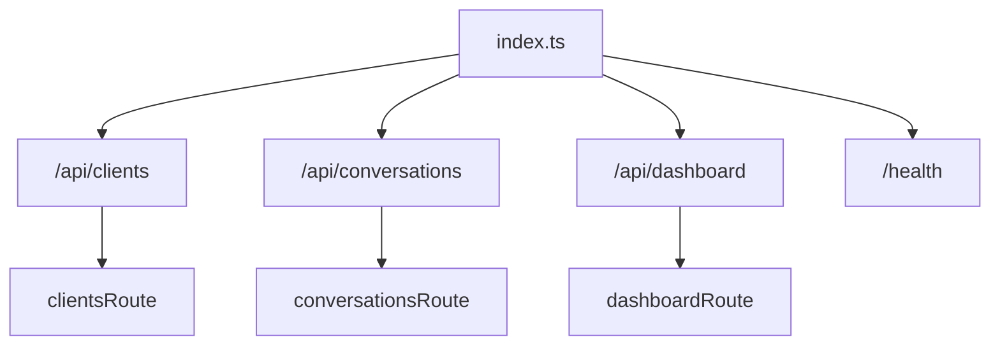

## Backend Route Architecture

Implemented centralized API route management for:

```txt id="jqh1qv"
/api/clients
/api/conversations
/api/dashboard
/health
```

## Backend Middleware System

Implemented reusable middleware architecture for:

* authentication
* request logging
* centralized error handling
* CORS management
* protected route validation

## Backend Middleware Pipeline

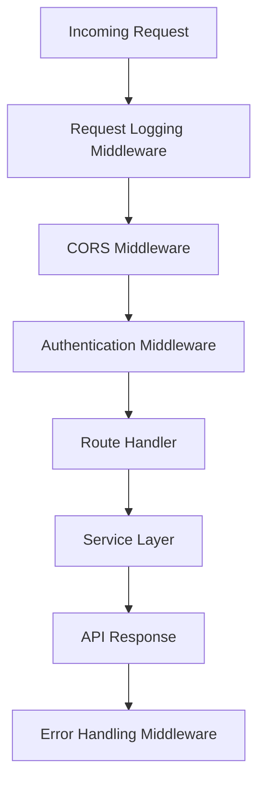

## Authentication Middleware

Implemented bearer-token authentication validation using:

```txt id="9xpx1m"
Authorization: Bearer <token>
```

The middleware validates authenticated users before allowing access to protected API routes.

Protected backend routes include:

```txt id="c83n54"
/api/clients
/api/conversations
/api/dashboard
```

## Authentication Middleware Flow

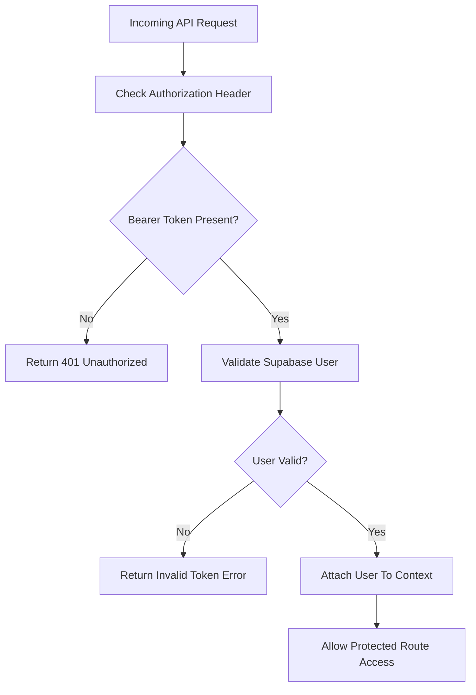

## Unauthorized Access Protection

Unauthorized requests automatically return:

```json id="69j8oj"
{
  "success": false,
  "error": {
    "code": "UNAUTHORIZED",
    "message": "Missing bearer token."
  }
}
```

This prevents unauthorized API access.

## Screenshot — Protected API Authorization


## Backend Health Monitoring

Implemented health monitoring endpoints for validating backend runtime availability.

Health endpoints:

```txt id="xzh4o4"
/health
```

Used for:

* deployment verification
* uptime validation
* runtime health checks
* infrastructure monitoring

## Local Worker Runtime Validation

Validated backend runtime locally using:

```bash id="rqx3r0"
npx wrangler dev
```

Local worker runtime accessible at:

```txt id="jmbz1g"
http://localhost:8787
```

## Screenshot — Local Worker API Root


## Screenshot — Local Worker Health Endpoint


## Production Worker Deployment

Deployed backend infrastructure to Cloudflare Workers production environment.

Production API endpoint:

```txt id="8xjlwm"
https://student-crm-api.student-crm-platform.workers.dev
```

## Screenshot — Production Worker Health Endpoint


## Screenshot — Worker Deployment Success


## Cloudflare Worker Authentication

Authenticated Wrangler CLI with Cloudflare account for deployment access.

## Screenshot — Cloudflare Login Success


## Cloudflare Secret Management

Implemented secure environment secret management using:

```bash id="q0tdkg"
npx wrangler secret put SUPABASE_URL

npx wrangler secret put SUPABASE_SERVICE_ROLE_KEY
```

This protects sensitive backend credentials from being exposed in source code.

## Screenshot — Cloudflare Worker Secrets


## Backend Service Layer Architecture

Implemented reusable service-layer architecture for database operations.

Service responsibilities include:

* database queries
* analytics aggregation
* validation handling
* centralized business logic
* reusable API operations

# Frontend to Backend Communication Flow

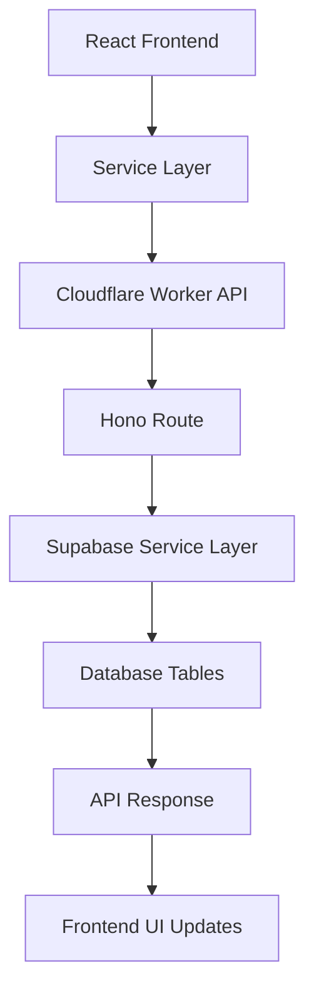

## Clients Backend API

Implemented backend API support for:

* retrieving CRM clients
* creating new clients
* centralized client database access

## Screenshot — Backend Powered Clients Module


## Conversations Backend API

Implemented backend messaging infrastructure for:

* retrieving conversations
* creating messages
* realtime-ready messaging workflows

## Screenshot — Backend Powered Conversations Module


## Dashboard Analytics Backend

Implemented centralized backend analytics aggregation system.

Analytics API now computes:

* total clients
* active leads
* won deals
* lost deals
* total conversations
* pipeline stage distribution

This moves analytics processing from frontend-only logic into centralized backend services.

## Dashboard Analytics Processing Flow

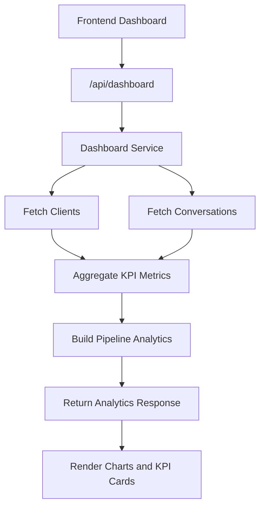

## Screenshot — Backend Powered Dashboard


## Frontend and Backend Separation

The application architecture was intentionally separated into:

### Frontend Responsibilities

* UI rendering
* user interaction
* component management
* client-side state management

### Backend Responsibilities

* data aggregation
* authentication validation
* database operations
* analytics processing
* protected API access
* centralized business logic

This separation improves:

* scalability
* maintainability
* enterprise readiness
* security
* testing workflows

## API Response Standardization

Implemented reusable API response utilities for consistent backend responses.

Successful responses follow:

```json id="4r14gm"
{
  "success": true,
  "data": {}
}
```

Error responses follow:

```json id="8u17pj"
{
  "success": false,
  "error": {}
}
```

This creates predictable frontend/backend communication patterns.

## Request Validation System

Implemented request validation using:

```txt id="0nd2rr"
Zod
```

combined with:

```txt id="l3j0hn"
@hono/zod-validator
```

This validates incoming API payloads before database operations are executed.

## Frontend Production Build Validation

Validated frontend production build using:

```bash id="7psjqw"
npm run build
```

## Screenshot — Frontend Production Build


## Backend Engineering Decisions

### Why Cloudflare Workers?

Cloudflare Workers were selected because they provide:

* lightweight edge execution
* fast deployment
* serverless scalability
* low operational overhead
* global runtime distribution

### Why Hono?

Hono was selected because it provides:

* lightweight API architecture
* middleware support
* excellent TypeScript integration
* edge-runtime compatibility
* scalable route organization

### Why Separate Backend from Frontend?

Separating backend responsibilities from frontend logic improves:

* application scalability
* cleaner architecture
* reusable APIs
* easier testing
* security boundaries
* future mobile app compatibility

## Real Engineering Challenges Encountered

During implementation, several backend engineering challenges were encountered involving:

* worker deployment configuration
* Cloudflare route setup
* authentication middleware validation
* protected API access
* frontend/backend integration
* dashboard analytics aggregation
* API response consistency
* Supabase service-role integration
* deployment environment configuration

Resolving these issues reinforced understanding of:

* edge computing architecture
* backend middleware systems
* API infrastructure design
* protected route systems
* production deployment workflows
* service-layer architecture
* serverless backend engineering

## Task 10 Engineering Outcome

Successfully implemented:

* backend API infrastructure
* Cloudflare Workers deployment
* Hono backend architecture
* protected API routes
* middleware-based request processing
* centralized service layer
* backend analytics engine
* secure secret management
* production deployment workflows
* frontend/backend separation
* scalable SaaS backend architecture
* enterprise-style API engineering

## ✅ Task 11 — Deal Management Backend System

### Objective

Implement a production-style CRM deal management backend system using Cloudflare Workers, Hono, and Supabase relational architecture.

This phase introduces:

* backend deal management APIs
* protected CRM business workflows
* relational deal ownership architecture
* pipeline stage tracking
* deal activity history
* production-style backend infrastructure
* scalable workflow modeling

## Deal Management Backend Architecture

Implemented modular backend architecture for CRM deal management workflows.

### Backend Structure

```txt
worker/src
├── routes
│   └── deals.ts
├── services
│   └── deal.service.ts
├── middleware
│   ├── auth.ts
│   ├── error-handling.ts
│   └── request-logging.ts
├── lib
│   └── api-response.ts
└── index.ts
```

### Architecture Goals

* isolate backend business logic
* preserve scalable API architecture
* separate routing from database operations
* centralize Supabase integration
* enforce protected backend access
* maintain production-ready modular structure

## CRM Deal Management Infrastructure

Implemented backend APIs for:

* deal retrieval
* deal creation
* pipeline stage management
* deal notes management
* stage history tracking
* protected backend workflows

The backend architecture now supports real CRM operational workflows used in modern SaaS sales platforms.

## Deal Database Architecture

Implemented relational database infrastructure using Supabase PostgreSQL.

### Deals Table Structure

The deals table stores:

* client relationships
* deal ownership
* pipeline stages
* revenue metadata
* intake information
* loss tracking
* timestamp auditing

### Deal Ownership Architecture

Each deal can now be associated with:

```txt
owner_id
```

This architecture supports:

* sales representative ownership
* manager reassignment workflows
* role-aware CRM operations
* scalable pipeline management

## Deal Stage History System

Implemented automatic pipeline history tracking using:

```txt
deal_stage_history
```

This architecture records:

* previous pipeline stage
* new pipeline stage
* user responsible for change
* stage transition timestamps

### CRM Pipeline Flow


This mirrors real-world CRM sales progression systems used in production SaaS platforms.

## Backend Workflow Architecture

```mermaid
graph TD

A[Frontend CRM Dashboard]
--> B[Protected Deal API Routes]

B --> C[Auth Middleware]

C --> D[Deal Service Layer]

D --> E[Supabase PostgreSQL]

E --> F[Deals Table]

E --> G[Deal Stage History]

E --> H[Deal Notes]
```

The architecture separates:

* frontend presentation
* API routing
* authentication enforcement
* business logic
* relational database operations

This improves:

* maintainability
* scalability
* debugging
* modularity
* future extensibility

## Protected Backend API System

Implemented protected backend endpoints using Hono middleware authentication.

### Protected Endpoints

```txt
GET    /api/deals
POST   /api/deals
PATCH  /api/deals/:dealId/stage
POST   /api/deals/notes
```

All protected routes now require:

```txt
Authorization: Bearer <supabase_access_token>
```

Unauthorized requests are rejected automatically by backend middleware.

## Authentication Enforcement

The backend authorization system prevents unauthenticated access to protected CRM APIs.

### Authorization Protection Screenshot


This demonstrates:

* protected backend architecture
* authentication middleware enforcement
* production API security behavior
* unauthorized request rejection

## Cloudflare Worker Backend Infrastructure

The backend API is deployed and executed using:

* Cloudflare Workers
* Hono framework
* Supabase backend integration

### Worker Startup Verification


### Worker Health Check Verification


This verifies:

* successful Worker execution
* backend runtime stability
* API infrastructure availability
* production-style deployment workflow

## Relational Database Architecture

Implemented normalized relational CRM schema using Supabase PostgreSQL.

### Production CRM Schema Architecture


The schema now supports:

* client relationships
* conversations
* deal ownership
* deal activity tracking
* stage history auditing
* scalable CRM workflows

## Deals Table Structure

Implemented normalized deals table architecture.

### Deals Table Screenshot


The deals table now supports:

* relational client association
* owner assignment
* pipeline stage management
* CRM financial tracking
* timestamp auditing

## Deal Stage History Table

Implemented pipeline auditing infrastructure using relational stage history tracking.

### Deal Stage History Screenshot


This architecture enables:

* historical pipeline tracking
* audit logging
* workflow visibility
* CRM activity monitoring

## Deal Notes System

Implemented relational deal notes infrastructure.

### Deal Notes Table Screenshot


The notes system supports:

* sales collaboration
* internal CRM communication
* activity tracking
* future timeline rendering

## Engineering Decisions

### Service Layer Isolation

Database operations were intentionally isolated inside:

```txt
services/deal.service.ts
```

Benefits:

* reusable business logic
* cleaner route architecture
* easier debugging
* scalable backend structure

### Route Layer Separation

API request handling was isolated inside:

```txt
routes/deals.ts
```

Benefits:

* modular API organization
* simplified middleware integration
* scalable endpoint management
* maintainable backend structure

### Middleware-Based Protection

Authentication enforcement was centralized using:

```txt
auth middleware
```

Benefits:

* reusable authorization logic
* centralized backend protection
* scalable API security
* cleaner route implementation

## Real Engineering Challenges Encountered

During implementation, several backend architecture challenges were encountered involving:

* protected API route handling
* relational database modeling
* deal ownership architecture
* pipeline history relationships
* middleware authentication workflows
* Supabase relational constraints

### API Authorization Validation

Backend testing confirmed that unauthorized requests were correctly rejected when bearer tokens were missing.

This debugging process reinforced understanding of:

* backend authentication workflows
* API security enforcement
* middleware architecture
* protected route systems
* production API behavior

## Task 11 Engineering Outcome

Successfully implemented:

* production CRM deal backend system
* protected backend APIs
* modular Hono route architecture
* Supabase relational deal modeling
* deal ownership infrastructure
* pipeline stage history tracking
* relational notes system
* backend authorization enforcement
* production-style Worker architecture
* scalable CRM workflow infrastructure

## ✅ Task 12 — Client Relationship Management Detail System

### Objective

Build a relational Client Relationship Management Detail System for the Student CRM Platform.

This phase transformed the CRM from isolated feature pages into a unified relationship-driven workspace by introducing:

* dynamic client relationship routing
* relational client detail aggregation
* conversation integration
* CRM activity timeline architecture
* modular relationship workspace components
* reusable relational service hooks
* unified client workspace experience

## Client Relationship Workspace Overview

Implemented a production-style client relationship workspace responsible for:

* loading relational client data
* displaying client conversations
* rendering linked CRM activities
* aggregating client history
* organizing CRM relationships
* centralizing client context
* improving CRM navigation experience

The client relationship workspace now acts as a unified CRM relationship layer between:

```txt id="t121"
Clients
    ↓
Client Relationship Workspace
    ↓
Conversations + Activity + Deals
```

## Relationship Workspace Architecture

The client relationship architecture was designed using modular component-based principles.

### Relationship Workspace Flow

```mermaid
graph TD

A[Client List]
--> B[Dynamic Client Route]

B --> C[Client Relationship Workspace]

C --> D[Client Profile]

C --> E[Conversations]

C --> F[Deals]

C --> G[Activity Timeline]

G --> H[CRM Activity Events]
```

This architecture improves:

* CRM organization
* relational visibility
* workspace scalability
* component maintainability
* relationship-driven workflows

## Client Relationship Feature Structure

```txt id="t122"
src/pages/client-detail-page.tsx

src/features/clients
├── components
│   ├── client-profile-card.tsx
│   ├── client-conversations-card.tsx
│   ├── client-deals-card.tsx
│   └── client-activity-timeline.tsx
├── hooks
│   └── use-client-detail.ts
└── services
    └── client-detail.service.ts
```

## Relationship Architecture Breakdown

### Dynamic Client Routing

Implemented relational client routing using:

```txt id="t123"
/clients/:clientId
```

This introduced:

* dynamic client workspaces
* relational CRM navigation
* scalable client page architecture

Each client now has an independent relationship workspace.

### Client Profile Layer

Responsible for rendering:

* client information
* contact details
* company data
* CRM status
* client metadata

This creates:

* centralized client visibility
* unified relationship context

### Conversations Layer

Responsible for rendering:

* relational client messages
* latest conversation history
* CRM communication updates

The client relationship workspace now integrates directly with:

```txt id="t124"
conversations
```

stored inside Supabase.

This introduced:

* relational CRM communication
* unified messaging visibility
* real client interaction history

### Activity Timeline Layer

Responsible for rendering:

* CRM events
* client creation history
* conversation activity
* relationship timeline updates

Implemented timeline events:

| Event Type          | Purpose                      |
| ------------------- | ---------------------------- |
| Client Created      | CRM onboarding history       |
| Conversation Events | CRM communication tracking   |
| Relationship Events | relational activity timeline |

This introduced:

* CRM relationship visibility
* activity-driven workflows
* centralized relationship tracking

### Deals Relationship Layer

Responsible for rendering:

* linked client deals
* relationship deal visibility
* CRM pipeline connections

Integrated relational support for:

```txt id="t125"
deals
deal_notes
deal_stage_history
```

This created:

* relationship-based pipeline visibility
* unified client sales tracking

### Hooks Layer

```txt id="t126"
hooks/
```

Responsible for:

* fetching relational client data
* managing client detail state
* abstracting relational queries
* reusable relationship logic

This improves:

* frontend maintainability
* reusable relational workflows
* component scalability

### Services Layer

```txt id="t127"
services/
```

Responsible for:

* backend API communication
* relational client aggregation
* reusable client relationship requests

The frontend follows:

```txt id="t128"
Pages
↓
Hooks
↓
Services
↓
Backend API
↓
Supabase
```

This improves:

* scalability
* maintainability
* API organization
* reusable frontend architecture

## Backend API Integration

Implemented relational client detail integration using:

```txt id="t129"
GET /api/clients/:clientId
```

The backend aggregates relational data from:

* clients
* conversations
* deals
* deal notes
* activity events

This introduced:

* relational API aggregation
* centralized client workspace loading
* unified CRM relationship responses

## Environment Configuration Challenge

During implementation, a major backend issue occurred because the Worker runtime environment variables were not configured.

### Runtime Error

```txt id="t1210"
Supabase environment variables are not configured.
```

The issue was resolved by configuring:

```env
SUPABASE_URL=
SUPABASE_ANON_KEY=
SUPABASE_SERVICE_ROLE_KEY=
```

inside:

```txt id="t1211"
worker/.dev.vars
```

This restored:

* backend authentication
* Supabase API communication
* relational client loading
* protected route execution

## Relationship Verification

The following relational CRM features were verified successfully.

| Feature                       | Verification Status |
| ----------------------------- | ------------------- |
| Dynamic client routing        | ✅ Verified          |
| Client relationship workspace | ✅ Verified          |
| Conversation rendering        | ✅ Verified          |
| Activity timeline rendering   | ✅ Verified          |
| Backend relational API        | ✅ Verified          |
| Supabase integration          | ✅ Verified          |
| Protected API communication   | ✅ Verified          |

## Screenshot — Clients Page

Shows:

* CRM client management
* relational client listing
* client navigation workflow


## Screenshot — Conversations Workspace

Shows:

* CRM conversation system
* relational client messaging
* live conversation rendering


## Screenshot — Client Relationship Workspace

Shows:

* unified client workspace
* client conversations
* activity timeline
* relationship-driven CRM architecture


## Relationship Engineering Concepts Learned

Task 12 introduced several important CRM engineering concepts.

### Dynamic Relational Routing

Understanding how scalable CRM workspaces are built using dynamic relationship-based routes.

### Relational Data Aggregation

Combining multiple relational entities into one unified workspace.

### Unified CRM Workspaces

Building centralized client relationship dashboards.

### Activity Timeline Architecture

Tracking CRM activity history using relational timeline systems.

### Frontend Relational Architecture

Understanding how:

```txt id="t1212"
Pages
↓
Hooks
↓
Services
↓
Backend APIs
↓
Supabase
```

work together to power scalable frontend systems.

## Real Engineering Challenges Encountered

During implementation, several frontend and backend engineering concerns were handled:

* dynamic route configuration
* backend relational aggregation
* Worker runtime environment configuration
* Supabase authentication setup
* relational conversation rendering
* activity timeline synchronization
* CRM hierarchy consistency
* frontend layout refinement
* duplicate page hierarchy handling
* CORS troubleshooting
* protected API communication

This improved understanding of:

* relational CRM systems
* frontend architecture
* backend aggregation patterns
* API-driven CRM workflows
* scalable relationship workspaces
* enterprise CRM engineering

## Task 12 Engineering Outcome

Successfully implemented:

* dynamic client relationship routing
* relational client workspace architecture
* conversation integration system
* activity timeline rendering
* reusable relationship components
* frontend relational hooks
* backend relationship aggregation
* Supabase relational integration
* CRM workspace hierarchy improvements
* unified client relationship experience
* scalable CRM relationship workflows
* enterprise-style relationship-driven CRM architecture
