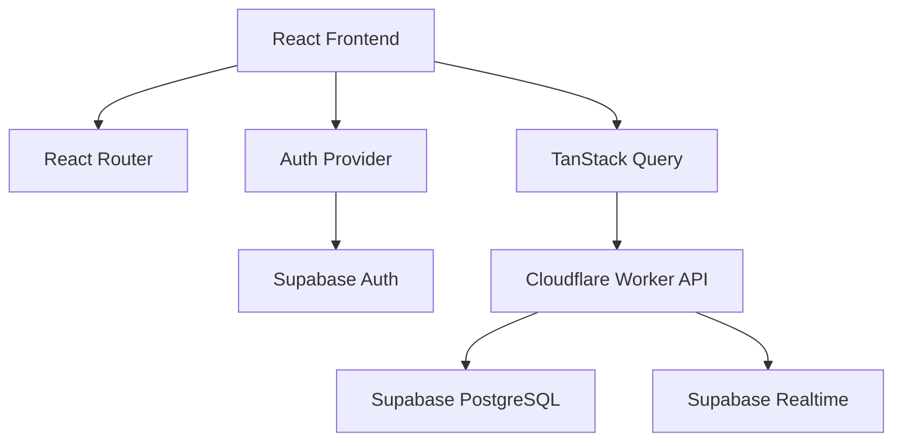
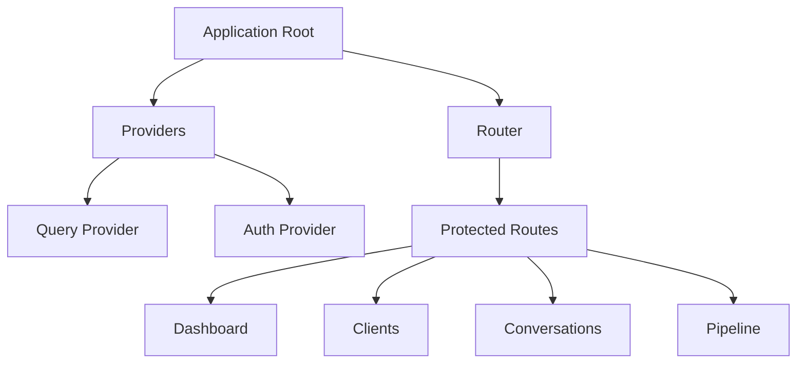
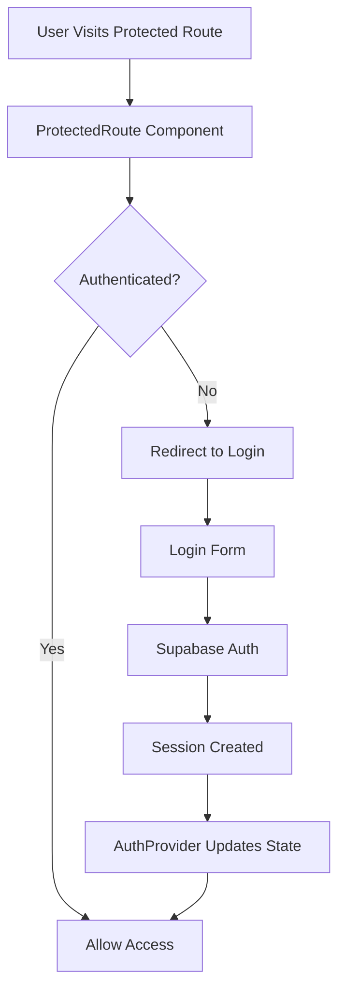
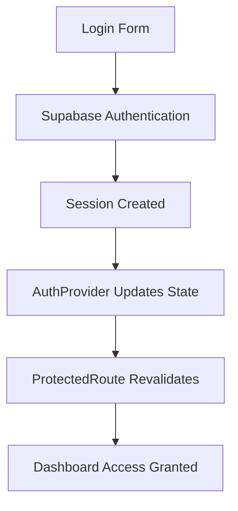
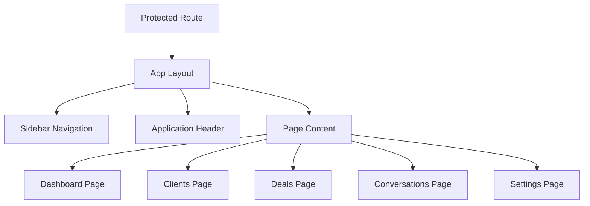
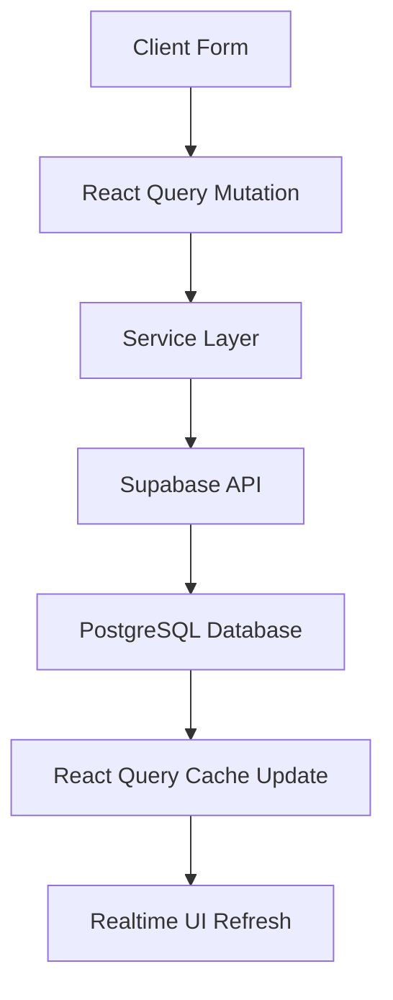
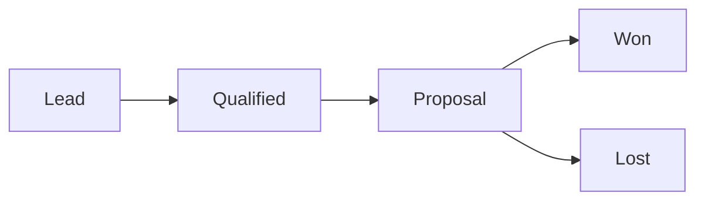

# 🎓 Student CRM Platform

Full stack CRM platform built for the SINC Full Stack Developer Test of Competence.


# 📌 Project Overview

Student CRM Platform is a production-style full stack CRM application designed for education sales teams.

The platform is being developed to manage:

* student lead onboarding
* realtime communication workflows
* sales assignment management
* deal ownership tracking
* pipeline stage progression
* role-aware access control
* operational sales visibility

This project is being built as part of the SINC Full Stack Developer Test of Competence.

The assessment evaluates the ability to design and deliver a modern SaaS-style application using scalable frontend architecture, secure authentication flows, realtime systems, relational data modeling, and production engineering practices.

# 🎯 Engineering Objectives

This project focuses on demonstrating practical full stack engineering capabilities through the implementation of a real-world CRM platform.

Core engineering goals include:

* scalable frontend architecture
* production-style authentication systems
* protected route handling
* role-aware application design
* relational database modeling
* realtime communication workflows
* maintainable project organization
* cloud-native development practices
* clean engineering documentation
* deployment-ready infrastructure

# 🧱 High-Level System Architecture

The application follows a modular cloud-native architecture using React on the frontend, Supabase for authentication and database infrastructure, and Cloudflare Workers for backend APIs.



# 🛠️ Technology Stack

## Frontend

* React
* TypeScript
* Vite
* React Router
* TanStack Query
* Tailwind CSS
* shadcn/ui

## Backend

* Hono
* Cloudflare Workers

## Database & Infrastructure

* Supabase PostgreSQL
* Supabase Auth
* Supabase Realtime

# ⚙️ Local Development Setup

## Clone Repository

```bash
git clone https://github.com/Holuphilix/student-crm-platform.git
```

## Navigate Into Frontend

```bash
cd frontend
```

## Install Dependencies

```bash
npm install
```

## Start Development Server

```bash
npm run dev
```

# 🔐 Environment Variables

Create a `.env` file inside:

```txt
frontend/
```

Add the following variables:

```env
VITE_SUPABASE_URL=your_project_url
VITE_SUPABASE_PUBLISHABLE_KEY=your_publishable_key
```

# 📂 Project Structure

```txt
student-crm-platform/
│
├── frontend/
├── worker/
├── README.md
```

# 🧠 Frontend Architecture

The frontend uses a feature-based architecture designed for scalability, maintainability, and production-style application organization.

## Frontend Structure

```txt
src/
  app/
    providers/
    router/

  components/
    layout/
    shared/
    ui/

  features/
    auth/
    clients/
    conversations/
    deals/
    dashboard/

  lib/
    api/
    supabase/
```

## Frontend Architecture Diagram



## Frontend Engineering Decisions

### Feature-Based Organization

Business logic is grouped by application domain instead of grouping files only by type.

Benefits:

* easier scalability
* cleaner separation of concerns
* simplified maintenance
* improved developer onboarding
* better long-term organization

### Centralized Providers

Core application infrastructure such as:

* authentication
* routing
* server state management

is centralized at the application root level.

This reduces architectural duplication and improves maintainability.

# 🔐 Authentication Architecture

Authentication is implemented using Supabase Auth with centralized React Context state management.

The authentication system currently includes:

* Supabase authentication integration
* global auth provider
* protected route handling
* reusable authentication hook
* persistent session management
* authenticated route redirection

## Authentication Flow Diagram



## Authentication Engineering Decisions

### Global Auth Provider

Authentication state is managed centrally using React Context.

Benefits:

* avoids prop drilling
* improves state accessibility
* enables scalable auth management
* simplifies protected route handling

### Protected Route Architecture

Protected routes are implemented to improve:

* user navigation flow
* authenticated access control
* application security UX

Important:
Frontend protection improves user experience, while backend authorization will later enforce ownership rules and role permissions.

### Session Persistence

Supabase session handling allows authenticated users to remain logged in across page refreshes and browser restarts.


# 🚀 Development Progress

## ✅ Task 1 — Project Foundation & Frontend Setup

### Objective

Establish the foundational frontend architecture and development environment for the CRM platform.

### Repository Initialization

Completed:

* created GitHub repository
* initialized Vite React TypeScript application
* configured development workspace

### Frontend Tooling Setup

Installed and configured:

* Tailwind CSS
* shadcn/ui
* React Router
* TanStack Query
* TypeScript path aliases

### Frontend Architecture Setup

Implemented scalable frontend structure:

```txt
src/
  app/
  components/
  features/
  lib/
  pages/
```

The architecture was designed early to support:

* modular scalability
* reusable business domains
* maintainable feature organization
* production-style application growth

### Supabase Integration

Completed:

* created Supabase project
* configured frontend environment variables
* integrated Supabase frontend SDK
* established frontend cloud infrastructure connection

### Task 1 Engineering Outcome

Successfully established:

* scalable frontend architecture
* cloud backend integration
* reusable project structure
* frontend infrastructure foundation
* development-ready environment

## ✅ Task 2 — Authentication System Implementation

### Objective

Implement secure authentication infrastructure with protected route handling and persistent session management.

### Authentication Infrastructure

Implemented:

* AuthProvider
* useAuth hook
* protected route architecture
* centralized auth state management
* session persistence handling

### Login System

Built login interface using:

* shadcn/ui
* Tailwind CSS
* Supabase authentication methods

Features implemented:

* email/password authentication
* loading state handling
* authentication error handling
* redirect after login
* persistent user sessions

### Protected Route System

Implemented route-level authentication protection.

Behavior:

```txt
Unauthenticated User → Redirect to /login
Authenticated User → Allow Dashboard Access
```

### Authentication Architecture Diagram



## Authentication Interface Preview

### Login Interface

The login page was implemented using:

- shadcn/ui
- Tailwind CSS
- Supabase authentication flow

The interface provides a clean authentication experience with protected route integration and session-aware authentication handling.


### Protected Dashboard Access

Authenticated users are redirected to protected application routes after successful authentication.

The dashboard route is protected using centralized authentication state validation through the `ProtectedRoute` component.


## Real Engineering Debugging Encountered

During implementation, modern TypeScript + Vite runtime issues were encountered involving:

```ts
import type
```

The issue was resolved by correctly separating:

* runtime imports
* TypeScript-only type imports

This debugging process reinforced understanding of:

* ESM modules
* Vite runtime behavior
* TypeScript type imports
* frontend debugging workflow

## Task 2 Engineering Outcome

Successfully implemented:

* authentication architecture
* protected routing system
* centralized auth management
* persistent session handling
* functional login workflow
* authenticated dashboard access

## ✅ Task 3 — Application Layout System

### Objective

Build the authenticated application shell architecture for the CRM platform.

This task establishes the foundational dashboard experience used across authenticated areas of the application.

The goal of this phase was to implement:

* reusable layout architecture
* sidebar navigation system
* authenticated application shell
* scalable route structure
* centralized navigation management
* production-style dashboard layout

## Application Layout Architecture

The application layout system was designed using reusable layout components to ensure scalability and maintainability as the CRM grows.

Implemented layout components:

```txt
components/layout/
├── app-layout.tsx
├── app-sidebar.tsx
└── app-header.tsx
```

## Implemented Features

### Sidebar Navigation System

Built a reusable sidebar navigation architecture using:

* shadcn/ui sidebar components
* React Router navigation
* Lucide React icons
* centralized navigation configuration

Navigation sections implemented:

* Dashboard
* Clients
* Conversations
* Deals
* Settings

### Centralized Navigation Configuration

Navigation items were abstracted into:

```txt
lib/navigation/navigation.config.ts
```

This approach avoids hardcoded navigation logic directly inside UI components.

Benefits:

* easier scalability
* reusable navigation rendering
* cleaner sidebar architecture
* easier future role-based access implementation
* improved maintainability

### Application Header System

Implemented reusable authenticated header containing:

* application title
* platform description
* logout functionality

Logout handling is connected directly to:

```ts
supabase.auth.signOut()
```

This automatically:

* clears user session
* updates AuthProvider state
* revalidates protected routes
* redirects users to login

### Authenticated Application Shell

Built reusable application shell architecture using:

```tsx
<AppLayout>
```

The layout provides:

* sidebar rendering
* responsive application structure
* shared authenticated UI
* centralized page rendering

All protected application pages now render inside the shared application shell.

## Layout Rendering Architecture


## Navigation Rendering Architecture

The sidebar navigation uses configuration-driven rendering.

```tsx
navigationItems.map()
```

This pattern enables scalable SaaS-style navigation systems commonly used in production dashboard applications.

Benefits include:

* dynamic navigation rendering
* centralized navigation logic
* future permission-aware routing
* reusable UI architecture

## Route Architecture

Protected application routes were expanded to support multiple authenticated pages.

Implemented routes:

```txt
/
/clients
/conversations
/deals
/settings
/login
```

Each protected route now follows layered architecture:

```tsx
<ProtectedRoute>
  <AppLayout>
    <Page />
  </AppLayout>
</ProtectedRoute>
```

## Engineering Decisions

### Reusable Layout Pattern

Instead of building navigation separately inside each page, a shared layout system was implemented.

Benefits:

* consistent UI structure
* scalable frontend architecture
* simplified page management
* reduced duplicated layout code

### Configuration-Driven Navigation

Navigation logic was separated from rendering logic.

This improves:

* maintainability
* scalability
* future role-based authorization support
* frontend architecture organization

### Component-Based Layout Design

The dashboard shell was broken into isolated components:

* sidebar
* header
* layout wrapper

This follows separation of concerns principles commonly used in scalable frontend systems.

## Task 3 Screenshots

### Authenticated Dashboard Layout


### Sidebar Navigation System


## Task 3 Outcome

Successfully implemented:

* authenticated application shell
* reusable layout architecture
* scalable sidebar navigation
* centralized navigation configuration
* responsive dashboard structure
* multi-page protected route system
* reusable SaaS-style frontend foundation

## ✅ Task 4 — Client Management System

### Objective

Implement a production-style client management workflow with authenticated CRUD-ready architecture, realtime UI synchronization, Supabase persistence, and scalable frontend data handling.

## Client Management Architecture

Implemented scalable client management infrastructure using:

* feature-based frontend architecture
* Supabase database integration
* React Query server-state management
* reusable service-layer architecture
* authenticated data workflows
* protected business routes

## Client Feature Structure

```txt
src/features/clients
├── components
├── hooks
│   └── use-clients.ts
├── services
│   └── client.service.ts
└── types
    └── client.types.ts
```

### Engineering Purpose

The client module was separated into:

| Layer | Responsibility |
|---|---|
| hooks | React Query business logic |
| services | database communication |
| types | centralized TypeScript contracts |
| components | reusable feature UI |

This architecture improves:

* scalability
* maintainability
* separation of concerns
* future feature expansion

## Database Integration

A dedicated `clients` table was created in Supabase PostgreSQL.

### Database Fields

| Column | Purpose |
|---|---|
| id | unique identifier |
| full_name | client name |
| email | client email |
| phone | contact number |
| company | organization |
| status | pipeline status |
| created_at | creation timestamp |

## Supabase Row Level Security (RLS)

Production-style database authorization was implemented using Supabase RLS policies.

### Policies Configured

| Policy | Purpose |
|---|---|
| SELECT policy | authenticated client retrieval |
| INSERT policy | authenticated client creation |

### Engineering Importance

RLS ensures:

* protected database access
* authenticated business operations
* backend-level authorization
* secure multi-user scalability

This reflects real SaaS security architecture where database authorization exists independently of frontend validation.

## React Query Integration

React Query was implemented for server-state management.

### Features Implemented

* automatic data fetching
* mutation handling
* cache synchronization
* optimistic UI refresh behavior
* loading state handling

### Data Flow Architecture



## Client Creation Workflow

Authenticated users can create new CRM client records directly from the dashboard interface.

### Features Implemented

* client onboarding form
* authenticated database insertion
* realtime table synchronization
* loading state handling
* success notifications
* validation handling
* reusable UI architecture

## Form Validation System

Frontend validation was implemented to improve UX quality and prevent invalid submissions.

### Validation Rules

* required full name
* required email
* email input typing
* disabled loading states

### Validation UX

Invalid submissions immediately trigger frontend feedback before database requests are executed.

## Toast Notification System

Professional toast notifications were implemented using:

```txt
sonner
```

### Notification Types

| Notification | Purpose |
|---|---|
| success toast | successful client creation |
| error toast | failed operation handling |
| validation toast | invalid form feedback |

### Engineering Benefit

This improves:

* UX responsiveness
* operational clarity
* user confidence
* production-level interaction flow

## Status Badge System

Client statuses were upgraded from plain text into reusable badge components.

### Current Status Support

* lead

### Future Expandability

The architecture now supports scalable CRM pipeline stages such as:

* qualified
* proposal
* negotiation
* won
* lost

## Client Management Interface

The application now supports authenticated client onboarding with realtime synchronization between the frontend and Supabase PostgreSQL.


## Validation Workflow

Frontend validation prevents incomplete submissions and improves operational usability.


## Engineering Decisions

### Feature-Based Module Design

The client system was implemented as an isolated feature module instead of placing all logic in page-level files.

Benefits:

* cleaner architecture
* easier onboarding for contributors
* scalable business-domain separation
* improved maintainability

### Service Layer Abstraction

Database logic was separated into dedicated services.

Benefits:

* reusable API logic
* cleaner React components
* easier backend replacement
* testability improvements

### React Query Adoption

React Query was selected over manual fetch/state management because it provides:

* automatic cache handling
* scalable async workflows
* simplified loading states
* improved frontend scalability

## Real Engineering Debugging Encountered

During implementation, Supabase Row Level Security initially blocked authenticated inserts.

This issue was resolved by correctly configuring:

* SELECT policies
* INSERT policies
* authenticated role permissions

This debugging process reinforced understanding of:

* database authorization
* backend security architecture
* Supabase RLS workflows
* frontend-to-database request pipelines

## Task 4 Engineering Outcome

Successfully implemented:

* authenticated client onboarding
* React Query architecture
* Supabase database persistence
* secure RLS authorization
* scalable feature module design
* realtime UI synchronization
* validation workflows
* toast notification system
* reusable status badge system
* production-style CRM data flow

## ✅ Task 5 — Deal Pipeline System

### Objective

Implement a scalable CRM deal pipeline system using Kanban-style workflow architecture for visual sales tracking and stage-based client management.

## Deal Pipeline Architecture

Implemented reusable pipeline board architecture using modular frontend component design.

### Pipeline Structure

The CRM pipeline is divided into the following stages:

```txt
Lead
Qualified
Proposal
Won
Lost
```

Each client record is dynamically grouped and rendered according to its current pipeline status.

## Pipeline Component Architecture

Implemented modular reusable pipeline components:

```txt
src/features/deals/
└── components
    ├── deal-card.tsx
    ├── pipeline-board.tsx
    └── pipeline-column.tsx
```

### Component Responsibilities

| Component | Responsibility |
|---|---|
| `pipeline-board.tsx` | orchestrates pipeline rendering |
| `pipeline-column.tsx` | renders grouped stage columns |
| `deal-card.tsx` | renders reusable CRM deal cards |

## Kanban-Style Workflow System

Implemented dynamic pipeline rendering architecture.

Features include:

* stage-based grouping
* dynamic deal counters
* reusable card rendering
* responsive pipeline columns
* modular SaaS dashboard structure
* scalable workflow architecture

## Deal Card System

Each CRM deal card displays:

* client full name
* email address
* company information
* pipeline status badge

The reusable card architecture enables future support for:

* drag-and-drop interactions
* deal ownership assignment
* activity tracking
* realtime updates
* revenue forecasting

## Pipeline Rendering Logic

Client records are dynamically grouped by:

```ts
status
```

Pipeline columns automatically update based on:

* Supabase database records
* React Query cache updates
* frontend state synchronization

## CRM Workflow Architecture

### Deal Lifecycle Flow



This architecture mirrors real-world CRM sales workflows used in modern SaaS systems.

## Responsive SaaS Dashboard Layout

The deal pipeline integrates directly into the authenticated application layout system.

Implemented features:

* responsive sidebar layout
* scalable dashboard spacing
* reusable dashboard containers
* responsive pipeline columns
* consistent SaaS interface styling

## Pipeline Board Screenshot

### Full Deal Pipeline Board


This screenshot demonstrates:

* dynamic stage rendering
* distributed deal management
* Kanban-style workflow visualization
* reusable CRM deal architecture
* responsive dashboard integration

## Engineering Decisions

### Modular Pipeline Architecture

The pipeline system was intentionally separated into reusable components to improve:

* maintainability
* scalability
* UI consistency
* future extensibility

This architecture supports future enhancements such as:

* drag-and-drop workflows
* realtime collaboration
* deal analytics
* role-aware permissions

### Configuration-Driven Workflow Rendering

Pipeline stages are rendered dynamically instead of hardcoding UI sections.

Benefits include:

* simplified maintenance
* easier workflow expansion
* centralized pipeline configuration
* scalable frontend logic

## Real Engineering Challenges Encountered

During implementation, a database schema issue was identified involving:

```txt
missing PRIMARY KEY configuration
```

This prevented Supabase row updates from functioning correctly.

The issue was resolved by properly configuring the database table with a primary key constraint.

This debugging process reinforced understanding of:

* relational database design
* primary key architecture
* Supabase table constraints
* production database requirements

## Task 5 Engineering Outcome

Successfully implemented:

* CRM pipeline architecture
* Kanban-style workflow system
* reusable deal card components
* dynamic status grouping
* responsive pipeline board
* scalable SaaS dashboard workflow
* production-style frontend structure