# 🎓 Student CRM Platform

Full stack education-sales CRM platform built for the SINC Full Stack Developer Test of Competence.


# 🌐 Live Application

**Production CRM URL:** https://student-crm-platform.student-crm-platform.workers.dev

**Source Repository:** https://github.com/Holuphilix/student-crm-platform

## Demo Login Details

Seeded reviewer accounts are documented in:

```txt
docs/demo-login-details.md
```

Default demo accounts:

| Role | Email | Password |
| --- | --- | --- |
| Administrator / Manager | `admin@studentcrm.test` | `StudentCRM@2026` |
| Sales Representative | `sales@studentcrm.test` | `StudentCRM@2026` |
| Client | `user@studentcrm.test` | `StudentCRM@2026` |

Create or update demo accounts in Supabase with:

```bash
npm --prefix worker run seed:demo-users
```

# 📌 Project Overview

Student CRM Platform is a production-style CRM for education sales teams. It manages the full relationship lifecycle from client registration through conversation assignment, sales follow-up, deal creation, pipeline progression, and administrative oversight.

The current implementation includes:

* Supabase authentication with registration, login, logout, password recovery, and session persistence.
* Role-aware portals for Admin / Manager, Sales, and Client users.
* Admin user management with role assignment, activation, deactivation, and sales team workload visibility.
* Client CRM records connected to authenticated profiles.
* Conversation threads with assignment and reassignment workflows.
* Deal creation, ownership, notes, activity feeds, and stage history.
* Role-aware dashboard analytics and clickable KPI navigation.
* Supabase Realtime synchronization across clients, conversations, deals, notes, and stage history.
* Hono API layer deployed on Cloudflare Workers with standardized responses, auth middleware, validation, logging, and error handling.

# 🧱 High-Level Architecture

The application is deployed as a Cloudflare Worker that serves the Vite frontend from static assets and exposes the Hono API under `/api/*`.

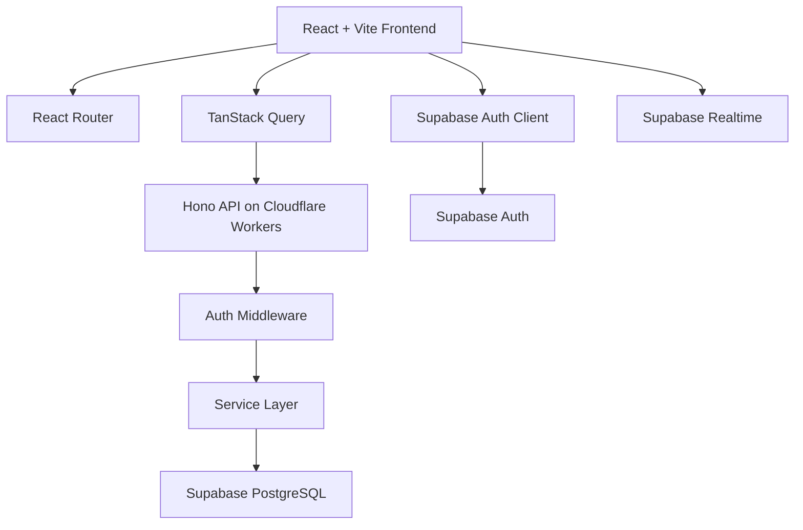

## Technology Stack

| Layer | Technology |
| --- | --- |
| Frontend | React, TypeScript, Vite, React Router, TanStack Query |
| UI | Tailwind CSS, shadcn/ui-style components, Lucide icons, Recharts, Sonner toasts |
| Backend | Hono, Cloudflare Workers |
| Database/Auth/Realtime | Supabase PostgreSQL, Supabase Auth, Supabase Realtime |
| Validation | Zod, `@hono/zod-validator` |
| Deployment | Cloudflare Workers Static Assets with GitHub integration |

# 👥 User Roles

The codebase supports `admin`, `manager`, `sales`, `client`, and legacy `user` roles. For assessment purposes, **Admin satisfies Manager requirements**. Existing `manager` checks are still supported, but the canonical seeded management account is `admin`.

## Admin / Manager

Admin users can:

* View global dashboard analytics and CRM monitoring.
* Manage users, roles, activation status, and sales team workload.
* View and manage all clients.
* View all conversations and assign or reassign them to Sales users.
* View all deals, reassign deal owners, and move any deal through the pipeline.
* Review deal notes, stage history, and activity timelines.
* Access account settings.

## Sales Representative

Sales users can:

* View a sales-focused dashboard with assigned conversations, unassigned conversations, owned active deals, won deals, and pipeline summary.
* View unassigned conversations and conversations assigned to them.
* Assign unassigned conversations to themselves.
* Reply to assigned conversations and view message history.
* View selectable CRM clients for deal creation.
* Create deals and automatically become the deal owner.
* Manage only deals they own.
* Add notes to owned deals and review stage history.
* Access account settings.

Sales users cannot:

* Modify another Sales user's deal.
* Reply to conversations assigned to another Sales user.
* Reassign deal ownership.
* Access Admin-only user management actions.

## Client

Client users can:

* Register and automatically receive both a Supabase profile and CRM client record.
* View a client-focused dashboard.
* Complete profile information: full name, phone, country, and target country.
* Start and continue their own conversation threads.
* View their own deal status and high-level application progress.
* Access settings.

Client users cannot:

* View another client's CRM data.
* View another client's conversations or deals.
* View internal deal notes.

# 🔐 Authentication & Authorization

Authentication is powered by Supabase Auth. The frontend stores the active session through the shared AuthProvider, and API calls include the Supabase bearer token through the API client.

Implemented authentication flows:

* Login and logout.
* Registration with full name, email, password validation, and profile creation.
* Password visibility toggles and password strength validation.
* Forgot password and reset password.
* Session persistence after refresh.
* Protected frontend routes.
* Backend bearer-token validation.
* Role-aware navigation and route protection.

Authorization is enforced in the Hono API and service layer, not only through frontend hiding. Examples:

* `/api/users/*` requires Admin / Manager access.
* Sales users can only mutate owned deals.
* Sales users can only reply to conversations assigned to them.
* Clients can only access their own client record, conversations, and deals.

# 🧭 Application Routes

| Route | Access | Purpose |
| --- | --- | --- |
| `/login` | Public | Login |
| `/register` | Public | Account registration |
| `/forgot-password` | Public | Password recovery request |
| `/reset-password` | Recovery session | Password reset |
| `/` | Authenticated | Role-aware dashboard |
| `/clients` | Admin, Manager, Sales | CRM client management |
| `/clients/:clientId` | Authorized CRM users | Client relationship workspace |
| `/conversations` | Authenticated, role-scoped | Conversations or My Conversations |
| `/deals` | Authenticated, role-scoped | Deal pipeline or My Deals |
| `/deals/:dealId` | Authorized CRM users | Deal workspace |
| `/profile` | Client, legacy User | Client profile management |
| `/users` | Admin, Manager | User and sales team management |
| `/settings` | Authenticated | Account settings; shown in the sidebar for Admin / Manager / Sales |

# 🔁 Core CRM Workflow

The implemented workflow follows the expected assessment path:

```txt
Client Registration
↓
Profile Creation + CRM Client Record Creation
↓
Profile Completion
↓
Conversation Creation
↓
Admin or Sales Conversation Assignment
↓
Sales Response
↓
Lead Qualification
↓
Deal Creation
↓
Deal Stage Progression
↓
Deal Notes + Activity Timeline
↓
Client Deal Tracking
↓
Administrative Oversight
```

The CRM keeps related records synchronized through API updates, TanStack Query invalidation, and Supabase Realtime subscriptions.

# 📊 Dashboard Analytics

The dashboard is role-aware:

* Admin / Manager sees global CRM analytics.
* Sales sees only their assigned or owned work.
* Client sees profile completion, conversations, and active deal status.

Admin analytics include:

* Total Clients
* Active Deals
* Won Deals
* Lost Deals
* Total Conversations
* Unassigned Conversations
* Total Sales Users
* Deals by Stage
* Deals by Owner
* Recent Activity
* Recent Clients

Dashboard cards and pipeline widgets are clickable and navigate to the related CRM pages or filtered views.

# 💬 Conversation Management

Conversation records are linked to CRM clients through `client_id`. A conversation message supports:

* `id`
* `client_id`
* `author_id`
* `assigned_to`
* `status`
* `message`
* `sender`
* `created_at`

Conversation features:

* Clients can start and view their own conversations.
* Admin can view all conversations.
* Sales can view unassigned conversations and assigned conversations.
* Admin can assign and reassign conversations to active Sales users.
* Sales can assign unassigned conversations to themselves.
* Conversation status supports `open`, `pending`, and `closed`.
* Supabase Realtime updates keep conversation views fresh.

# 🤝 Client Management

CRM clients are stored separately from authentication profiles but are linked through `profile_id` when available.

Implemented client features:

* Admin / Sales client listing.
* Client creation by Admin / Sales.
* Dynamic client detail workspace at `/clients/:clientId`.
* Client profile card.
* Related conversations.
* Related deals.
* Activity timeline generated from conversations, deal notes, and stage changes.
* Client portal profile updates for full name, phone, country, target country, and email where supported.

Client access is scoped so client users only see their own record.

# 💼 Deal Management

Deals are persisted in Supabase and managed through the Hono API.

Implemented deal features:

* Deal creation linked to a CRM client.
* Sales-created deals are owned by the Sales user.
* Admin / Manager can reassign deal ownership.
* Sales can manage owned deals only.
* Deal workspace at `/deals/:dealId`.
* Deal notes.
* Deal stage history.
* Activity feed combining deal creation, notes, and stage changes.
* Client status synchronization when deal stages change.
* Realtime pipeline refresh.

## Pipeline Stages

The assessment pipeline stages are:

| Stage | Purpose |
| --- | --- |
| `new_lead` | Newly created lead |
| `contacted` | Client has been contacted |
| `consultation_booked` | Consultation is scheduled |
| `documents_requested` | Documents requested from client |
| `application_started` | Application work has started |
| `submitted` | Application submitted |
| `won` | Deal successfully closed |
| `lost` | Deal lost |

The backend also includes compatibility handling for older Supabase stage values such as `lead`, `qualified`, and `proposal`.

# 👤 User Management

Admin / Manager users can manage CRM accounts from `/users`.

Implemented user management features:

* View all users.
* Create users with full name, email, password, and role.
* Assign roles: Admin, Sales, Client.
* Activate or deactivate users.
* View last sign-in information.
* View Sales team workload: assigned conversations and owned deals.

# 🗄️ Database Design

Supabase PostgreSQL stores the application data. Active SQL setup and migration files live in `docs/supabase/`.

Important SQL files:

| File | Purpose |
| --- | --- |
| `docs/supabase/profiles.sql` | Profile table support |
| `docs/supabase/conversations.sql` | Conversation table support |
| `docs/supabase/crm-ownership.sql` | Ownership columns and CRM relationships |
| `docs/supabase/assessment-alignment.sql` | Assessment role, pipeline, assignment, index, and realtime alignment |
| `docs/supabase/conversation-assignment-local-fix.sql` | Local assignment compatibility fix |

Core tables used by the current application:

| Table | Purpose |
| --- | --- |
| `profiles` | App identity, full name, email, role, status metadata |
| `clients` | CRM client records linked to profiles where possible |
| `conversations` | Client messages and assignment state |
| `deals` | Sales opportunities and ownership |
| `deal_notes` | Internal deal notes |
| `deal_stage_history` | Pipeline stage transition history |

Key relationships:

* `profiles.id` links to Supabase Auth users.
* `clients.profile_id` links a client CRM record to an authenticated user.
* `clients.owner_id` links a client to a Sales owner where assigned.
* `conversations.client_id` links messages to clients.
* `conversations.assigned_to` links a conversation to a Sales user.
* `deals.client_id` links deals to clients.
* `deals.owner_id` links a deal to a Sales owner.
* `deal_notes.deal_id` links notes to deals.
* `deal_stage_history.deal_id` links stage transitions to deals.

# 🔌 Backend API

All protected API routes require:

```txt
Authorization: Bearer <supabase_access_token>
```

Responses use a standardized shape:

```json
{
  "success": true,
  "data": {}
}
```

Errors use:

```json
{
  "success": false,
  "error": {
    "code": "ERROR_CODE",
    "message": "Human readable message"
  }
}
```

## Public and Health Endpoints

| Method | Endpoint | Purpose |
| --- | --- | --- |
| `GET` | `/` | API status |
| `GET` | `/health` | Worker health check |
| `GET` | `/health/config` | Supabase environment diagnostics |
| `POST` | `/api/auth/register` | Register a client account |

## Protected Endpoints

| Method | Endpoint | Purpose |
| --- | --- | --- |
| `GET` | `/api/me` | Current authenticated profile |
| `GET` | `/api/users` | List users |
| `POST` | `/api/users` | Create user |
| `GET` | `/api/users/sales-stats` | Sales team workload |
| `PATCH` | `/api/users/:userId/role` | Update role |
| `PATCH` | `/api/users/:userId/status` | Activate or deactivate user |
| `GET` | `/api/clients` | Role-scoped clients |
| `POST` | `/api/clients` | Create client |
| `GET` | `/api/clients/:clientId` | Client detail aggregation |
| `PATCH` | `/api/clients/:clientId` | Update client profile |
| `GET` | `/api/conversations` | Role-scoped conversations |
| `POST` | `/api/conversations` | Create conversation message |
| `GET` | `/api/conversations/:conversationId` | Conversation detail |
| `POST` | `/api/conversations/:conversationId/messages` | Reply to conversation |
| `PATCH` | `/api/conversations/:conversationId/assign` | Assign or reassign conversation |
| `PATCH` | `/api/conversations/:conversationId/status` | Update conversation status |
| `GET` | `/api/dashboard` | Role-aware analytics |
| `GET` | `/api/deals` | Role-scoped deals |
| `POST` | `/api/deals` | Create deal |
| `GET` | `/api/deals/:dealId` | Deal detail aggregation |
| `PATCH` | `/api/deals/:dealId/stage` | Update deal stage |
| `PATCH` | `/api/deals/:dealId/owner` | Reassign deal owner |
| `POST` | `/api/deals/:dealId/notes` | Add scoped deal note |
| `POST` | `/api/deals/notes` | Add deal note |

# ⚡ Realtime Synchronization

The frontend has reusable realtime hooks under `frontend/src/features/realtime/`.

Realtime subscriptions cover:

* `clients`
* `deals`
* `conversations`
* `deal_notes`
* `deal_stage_history`

When CRM data changes, related TanStack Query caches are invalidated so dashboards, pipelines, detail workspaces, conversations, and activity timelines refresh without manual page reloads.

# 📂 Project Structure

```txt
student-crm-platform/
├── frontend/
│   ├── src/
│   │   ├── app/
│   │   ├── components/
│   │   ├── features/
│   │   │   ├── auth/
│   │   │   ├── clients/
│   │   │   ├── conversations/
│   │   │   ├── dashboard/
│   │   │   ├── deals/
│   │   │   ├── realtime/
│   │   │   ├── settings/
│   │   │   └── users/
│   │   ├── lib/
│   │   └── pages/
│   ├── index.html
│   ├── package.json
│   └── vite.config.ts
├── worker/
│   ├── src/
│   │   ├── lib/
│   │   ├── middleware/
│   │   ├── routes/
│   │   ├── services/
│   │   ├── types/
│   │   └── index.ts
│   ├── scripts/
│   ├── package.json
│   └── wrangler.toml
├── docs/
│   ├── screenshots/
│   └── supabase/
├── wrangler.jsonc
└── README.md
```

# ⚙️ Local Development Setup

## 1. Clone Repository

```bash
git clone https://github.com/Holuphilix/student-crm-platform.git
cd student-crm-platform
```

## 2. Install Dependencies

```bash
npm --prefix frontend install
npm --prefix worker install
```

## 3. Configure Frontend Environment

Create `frontend/.env`:

```env
VITE_SUPABASE_URL=your_supabase_project_url
VITE_SUPABASE_PUBLISHABLE_KEY=your_supabase_publishable_or_anon_key
VITE_API_URL=http://localhost:8787
```

`VITE_API_URL` is optional in production when the frontend and API are served by the same Worker origin.

## 4. Configure Worker Environment

Create `worker/.dev.vars`:

```env
SUPABASE_URL=your_supabase_project_url
SUPABASE_SERVICE_ROLE_KEY=your_supabase_service_role_key
CORS_ORIGIN=http://localhost:5173
```

## 5. Apply Supabase SQL

Apply the SQL files in `docs/supabase/` through the Supabase SQL Editor. The assessment alignment migration should be applied after the base profile, conversation, and ownership SQL.

Recommended order:

```txt
profiles.sql
conversations.sql
crm-ownership.sql
assessment-alignment.sql
conversation-assignment-local-fix.sql
```

## 6. Seed Demo Users

```bash
npm --prefix worker run seed:demo-users
npm --prefix worker run verify:demo-users
npm --prefix worker run verify:schema
```

## 7. Start Local Backend

```bash
npm --prefix worker run dev
```

Worker runs on:

```txt
http://localhost:8787
```

## 8. Start Local Frontend

Open a second terminal:

```bash
npm --prefix frontend run dev
```

Frontend runs on:

```txt
http://localhost:5173
```

# 🚀 Deployment

The repository contains two Wrangler configurations:

| File | Purpose |
| --- | --- |
| `wrangler.jsonc` | Root deployment config used from the repository root |
| `worker/wrangler.toml` | Worker-local development/deployment config |

Both configurations serve the built Vite output from `frontend/dist` and use SPA fallback handling.

## Cloudflare Build Settings

Recommended Cloudflare build command:

```bash
npm --prefix frontend ci && npm --prefix worker ci && npm --prefix frontend run build
```

Recommended deploy command from the repository root:

```bash
npx wrangler deploy --config wrangler.jsonc
```

Root output/static asset directory:

```txt
frontend/dist
```

## Required Production Variables

Frontend build-time variables:

```env
VITE_SUPABASE_URL=your_supabase_project_url
VITE_SUPABASE_PUBLISHABLE_KEY=your_supabase_publishable_or_anon_key
```

Worker runtime variables/secrets:

```env
SUPABASE_URL=your_supabase_project_url
SUPABASE_SERVICE_ROLE_KEY=your_supabase_service_role_key
CORS_ORIGIN=https://student-crm-platform.student-crm-platform.workers.dev
```

Set sensitive Worker values as Cloudflare secrets:

```bash
npx wrangler secret put SUPABASE_URL --config wrangler.jsonc
npx wrangler secret put SUPABASE_SERVICE_ROLE_KEY --config wrangler.jsonc
```

# ✅ Validation Commands

```bash
npm --prefix worker run typecheck
npm --prefix frontend run build
npm --prefix worker run verify:demo-users
npm --prefix worker run verify:schema
```

# Application Screenshots

The screenshots below are organized by role and demonstrate the currently implemented workflows.

## Admin Portal

### Admin Dashboard KPI Overview

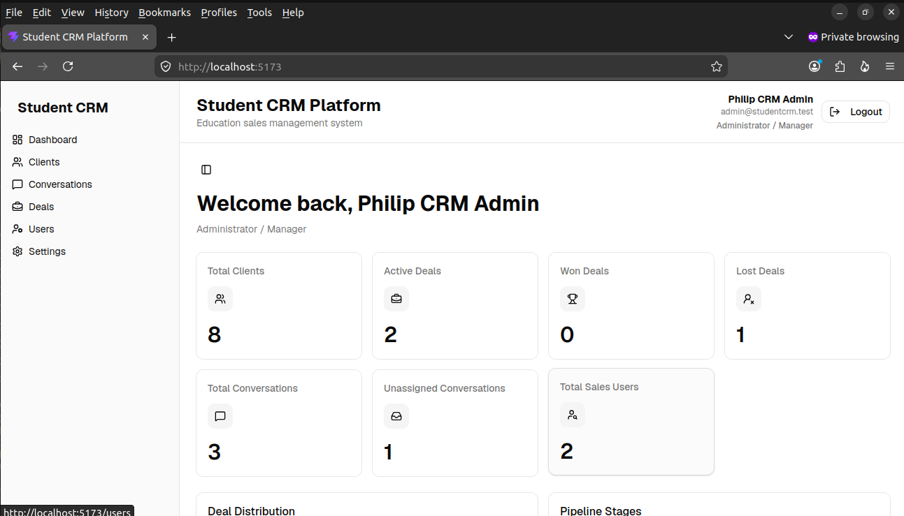

This screen demonstrates the Admin / Manager overview with global CRM KPIs, including clients, deals, conversations, and sales team metrics.

### Admin Dashboard Analytics

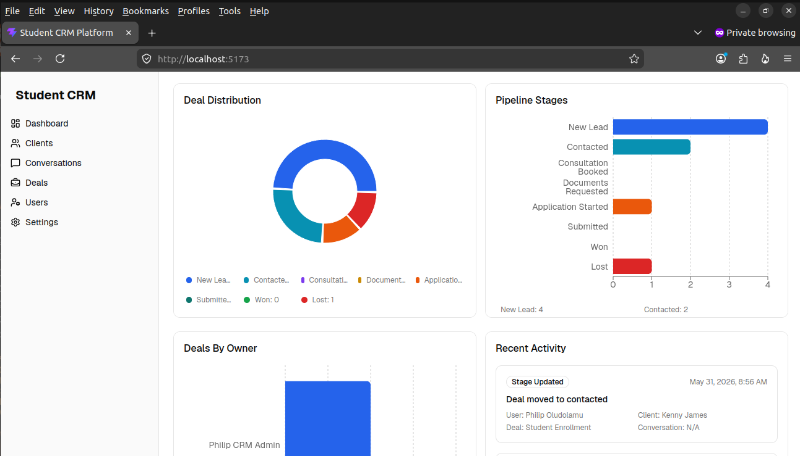

This view demonstrates visual analytics for pipeline distribution and CRM performance using Recharts-powered dashboard cards.

### Admin Recent Activity Feed

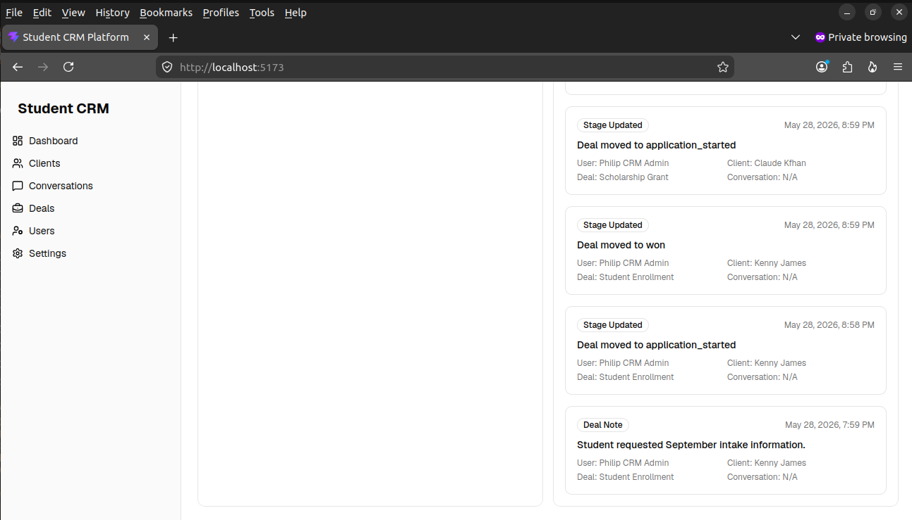

The activity feed shows CRM timeline events such as client activity, conversation updates, deal changes, and sales workflow updates.

### Admin User Management

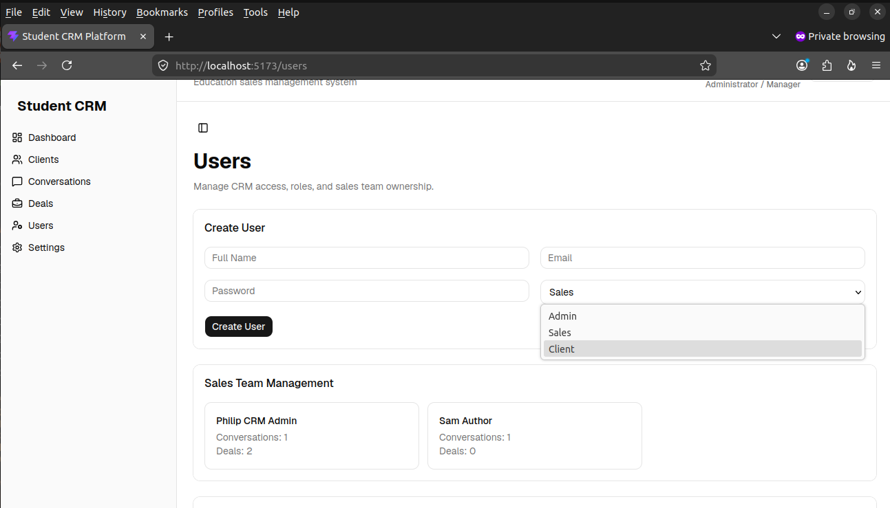

This screen demonstrates Admin user management, including creating users, assigning roles, activating or deactivating accounts, and reviewing Sales workload.

### Admin Conversation Assignment

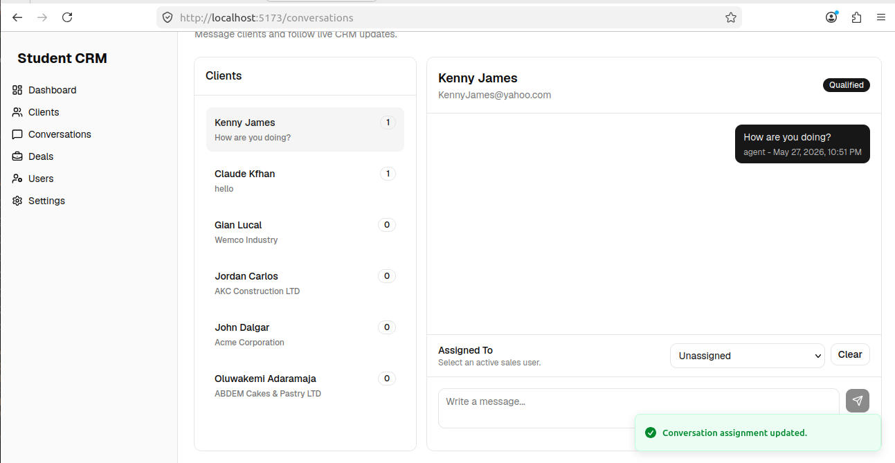

This workflow shows how Admin users assign or reassign client conversations to active Sales representatives.

### Admin Client Management


This page demonstrates CRM client management and navigation into the client relationship workspace.

### Admin Deal Pipeline


This board demonstrates the persisted Kanban-style deal pipeline grouped by CRM stage.

### Admin Deal Workspace


The deal workspace displays deal context, notes, stage history, and activity feed details.

### Admin Account Settings


This screen demonstrates SaaS-style account settings with profile information, email management, and password management.

## Sales Portal

### Sales Dashboard

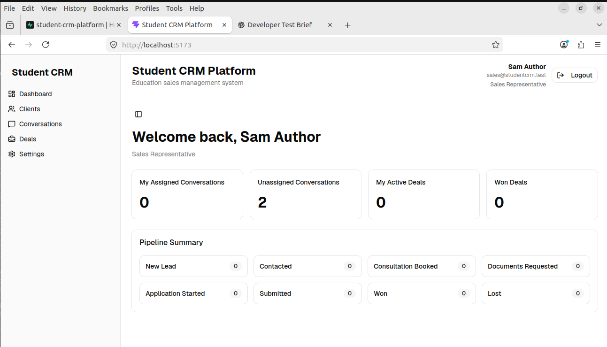

The Sales dashboard focuses on the representative's assigned conversations, unassigned conversations, owned active deals, won deals, and pipeline summary.

### Sales Conversation Assignment

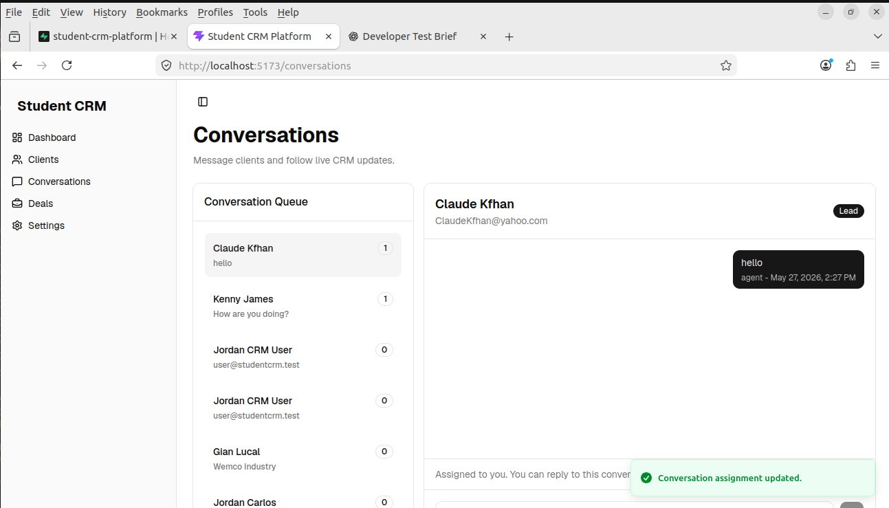

This screen demonstrates a Sales representative assigning an unassigned conversation to themselves.

### Sales Conversation Response

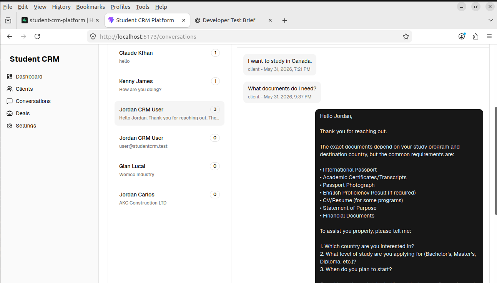

This conversation thread demonstrates Sales replying to an assigned client conversation.

### Sales Client Relationship Workspace

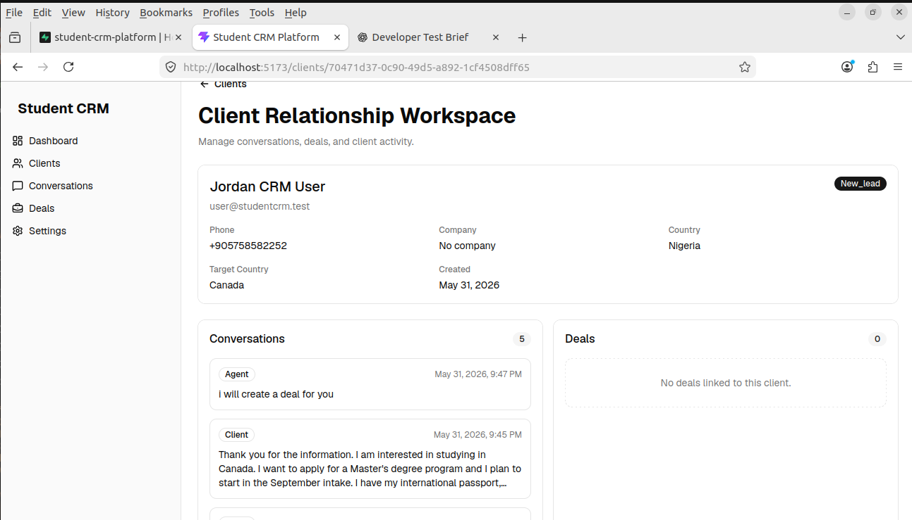

This workspace shows a Sales user's view of authorized client profile data, related conversations, related deals, and activity timeline.

### Sales Deal Workspace

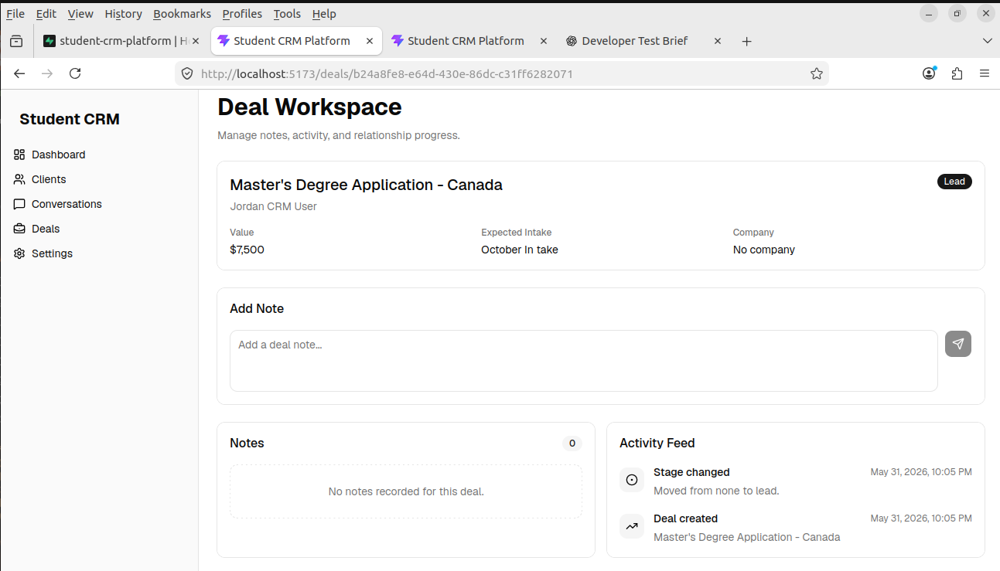

This page demonstrates Sales-owned deal management, including notes and pipeline activity.

### Sales Role Navigation


The Sales navigation demonstrates role-aware access: Sales users can work with clients, conversations, deals, dashboard, and settings without Admin-only user management.

## Client Portal

### Client Dashboard

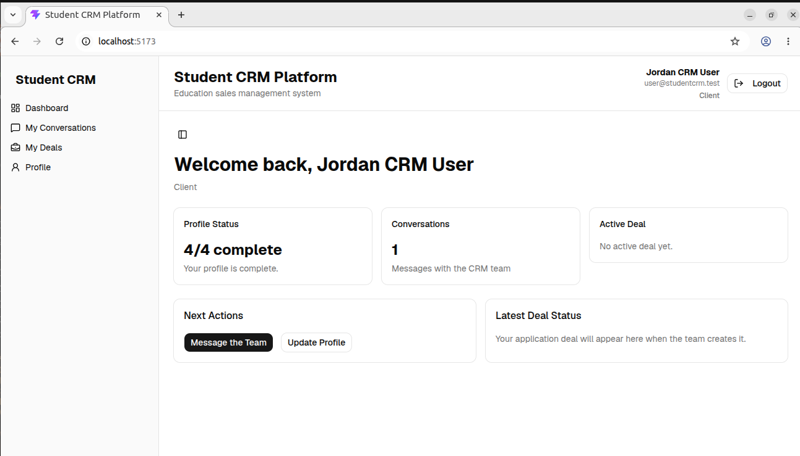

The Client dashboard provides profile completion status, conversation count, active deal status, and quick actions.

### Client Profile Management

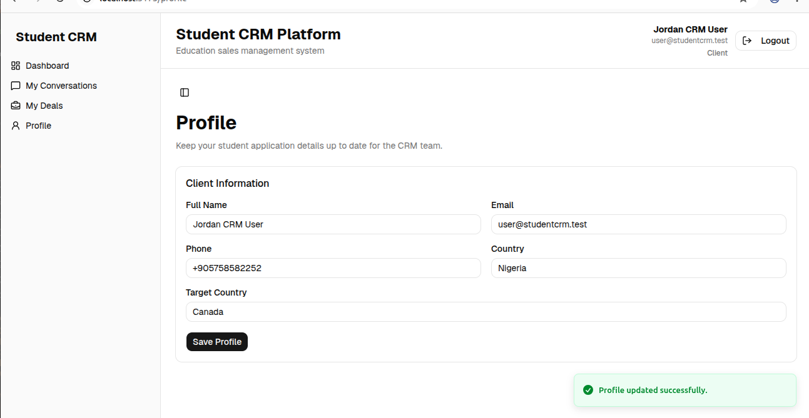

This page allows a Client to maintain CRM profile fields such as full name, phone, country, and target country.

### Client Conversation Portal

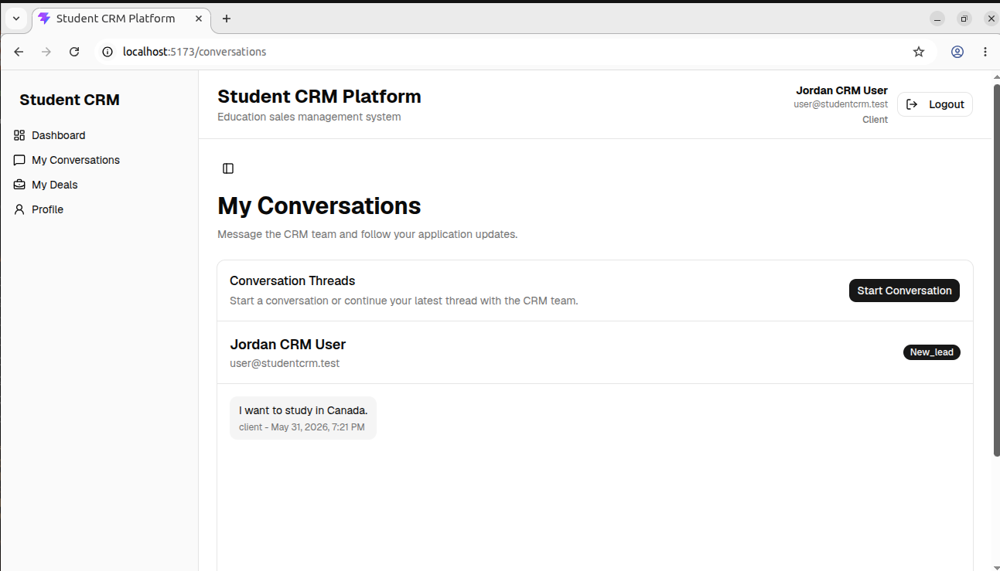

This view replaces internal CRM client lists with a client-appropriate My Conversations experience and start conversation workflow.

### Client Conversation Thread

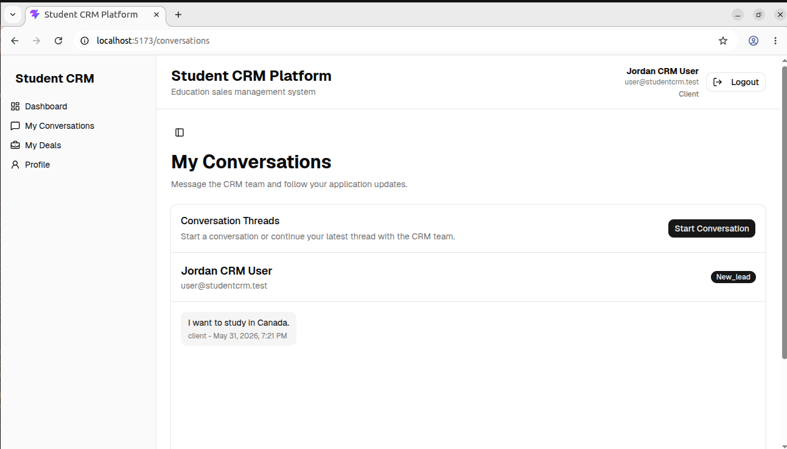

This screen demonstrates a client conversation thread with message history.

### Client Conversation With Sales Response

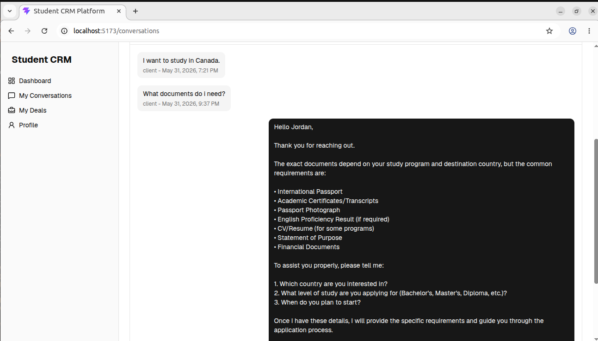

This workflow demonstrates the end-to-end conversation loop where a client message is answered by a Sales representative.

# 🧪 Current Review Notes

The application is currently aligned around these implemented capabilities:

* Admin is treated as Manager for the assessment.
* Client registration creates both a profile and CRM client record.
* Role-based navigation is present in the frontend.
* Backend services enforce role permissions for users, clients, conversations, and deals.
* Pipeline stages use the required assessment stage set.
* Legacy `user` accounts continue to work as Client accounts.
* The Worker serves both static frontend assets and API routes from the deployed Cloudflare origin.

# 📸 Additional Screenshots Available

The repository also contains authentication, deployment, Supabase schema, and debugging screenshots under `docs/screenshots/`. Useful additional documentation screenshots include:

* `login-page2.png`
* `register-page.png`
* `authentication-forgot-password-page.png`
* `authentication-reset-password-form.png`
* `supabase-profiles-table-schema.png`
* `production-crm-schema-architecture.png`
* `cloudflare-worker-setup.png`
* `environment-variables-configuration.png`

# 🧩 Future Improvements

Potential improvements beyond the current assessment implementation:

* Dedicated notification preferences.
* Rich audit log table for every Admin action.
* Email integration for client follow-ups.
* Advanced reporting filters by date range, owner, and country.
* Custom production domain.
* Deeper mobile layout optimization.

# Conclusion

Student CRM Platform is a full stack CRM application for education sales workflows. It combines React, TypeScript, Supabase, Hono, and Cloudflare Workers to deliver authenticated role-based portals, CRM relationship management, realtime conversations, deal pipeline management, dashboard analytics, user administration, and production deployment.

# Author

### Philip Oluwaseyi Oludolamu

Junior DevOps Engineer | Cloud Enthusiast | IT Professional

**Email:** [oluphilix@gmail.com](mailto:oluphilix@gmail.com)

**GitHub:** https://github.com/Holuphilix

**LinkedIn:** https://www.linkedin.com/in/philip-oludolamu
